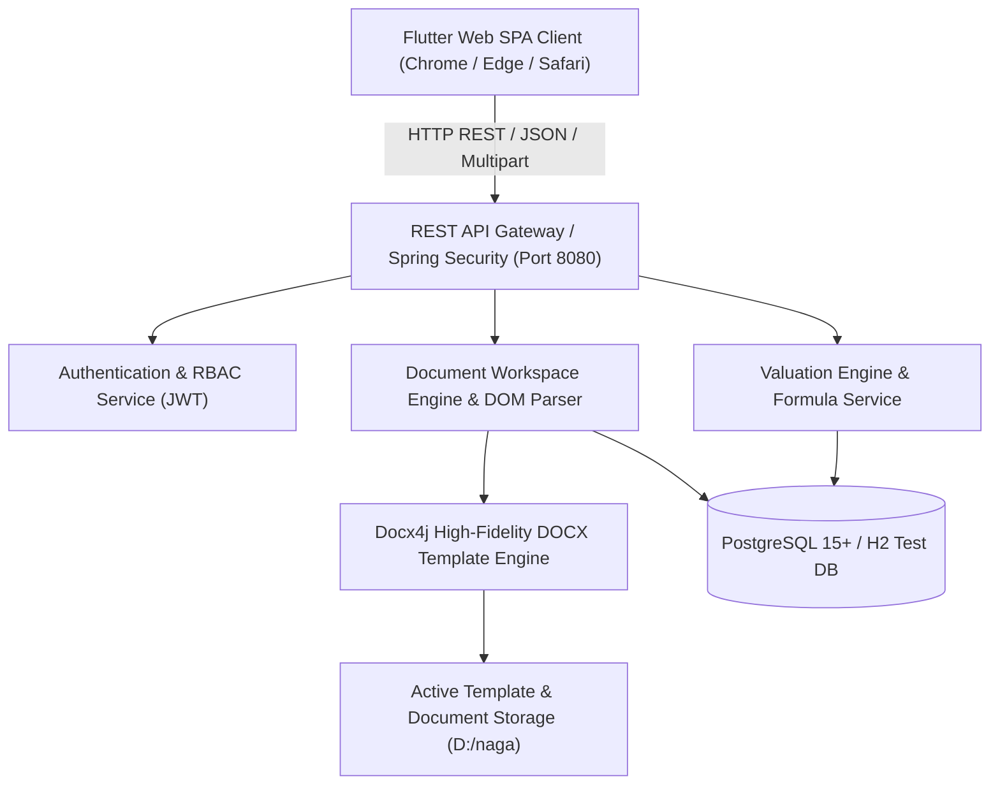
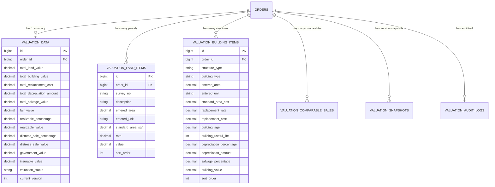
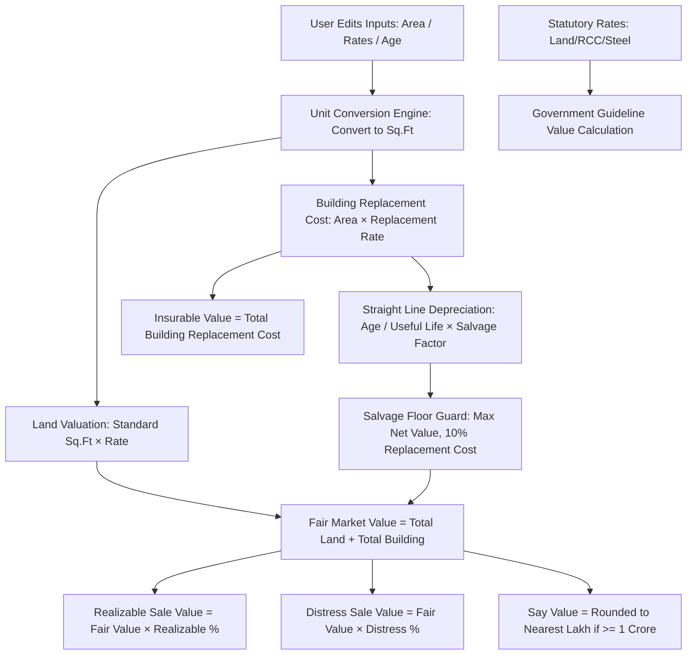
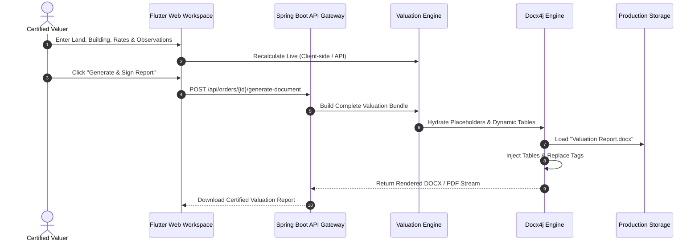

# VALUATION PLATFORM v1.0 PRODUCTION HANDBOOK
**Consolidated Technical Architecture, Governance, Valuation Formulas, Template Guidelines & Operations Runbook**

---

## Document Control & Metadata
- **Platform Version**: `v1.0.0-RELEASE (Gold Master)`
- **Classification**: Production Technical & Business Handbook
- **Release Date**: September 1, 2026
- **Architecture Baseline**: Spring Boot 3.3.x (Java 17) + Flutter 3.x Web + PostgreSQL / H2 + Docx4j Template Engine
- **Repository**: `https://github.com/mnagamallikmail-ui/visadocs.git`

---

# Table of Contents
1. [Document 1: System Architecture Handbook](#document-1-system-architecture-handbook)
   - 1.1 [Overall Architecture & System Topology](#11-overall-architecture--system-topology)
   - 1.2 [Frontend Architecture (Flutter Web Single Page App)](#12-frontend-architecture-flutter-web-single-page-app)
   - 1.3 [Backend Architecture (Spring Boot Micro-Services)](#13-backend-architecture-spring-boot-micro-services)
   - 1.4 [Database Architecture & Entity-Relationship Schema](#14-database-architecture--entity-relationship-schema)
   - 1.5 [Valuation Engine Architecture & Calculation Pipeline](#15-valuation-engine-architecture--calculation-pipeline)
   - 1.6 [Docx4j Template Engine Architecture](#16-docx4j-template-engine-architecture)
   - 1.7 [Dynamic Table Generation Architecture](#17-dynamic-table-generation-architecture)
   - 1.8 [Document Workspace UI/UX Architecture](#18-document-workspace-uiux-architecture)
   - 1.9 [End-to-End Report Generation & Compilation Flow](#19-end-to-end-report-generation--compilation-flow)
   - 1.10 [PDF / DOCX Compilation Pipeline](#110-pdf--docx-compilation-pipeline)
2. [Document 2: Valuation Formula & Calculation Guide](#document-2-valuation-formula--calculation-guide)
   - 2.1 [Land Valuation Formulas](#21-land-valuation-formulas)
   - 2.2 [Building Valuation & Replacement Cost](#22-building-valuation--replacement-cost)
   - 2.3 [Depreciation Calculation (Straight Line Method)](#23-depreciation-calculation-straight-line-method)
   - 2.4 [Salvage Value Floor Guard (10% Protection Rule)](#24-salvage-value-floor-guard-10-protection-rule)
   - 2.5 [Fair Market Value Formula](#25-fair-market-value-formula)
   - 2.6 [Realizable Sale Value (Bank Norms)](#26-realizable-sale-value-bank-norms)
   - 2.7 [Distress Sale Value (Forced Liquidation)](#27-distress-sale-value-forced-liquidation)
   - 2.8 [Insurable Value (Total Building Replacement Cost)](#28-insurable-value-total-building-replacement-cost)
   - 2.9 [Government / Guideline Statutory Valuation](#29-government--guideline-statutory-valuation)
   - 2.10 [Say Value (Presentation Rule)](#210-say-value-presentation-rule)
   - 2.11 [Comprehensive Worked Example Calculation](#211-comprehensive-worked-example-calculation)
3. [Document 3: Complete Canonical Placeholder Catalog](#document-3-complete-canonical-placeholder-catalog)
   - 3.1 [Dynamic Table Directives](#31-dynamic-table-directives)
   - 3.2 [Canonical Order & Metadata Placeholders](#32-canonical-order--metadata-placeholders)
   - 3.3 [Valuation Output & Currency Placeholders](#33-valuation-output--currency-placeholders)
   - 3.4 [Image & Photograph Slot Directives](#34-image--photograph-slot-directives)
4. [Document 4: Template Authoring Guide](#document-4-template-authoring-guide)
   - 4.1 [DOCX Template Design Principles](#41-docx-template-design-principles)
   - 4.2 [Dynamic Tables Embedding & Layout](#42-dynamic-tables-embedding--layout)
   - 4.3 [Property Value Table vs Summary Table Rules](#43-property-value-table-vs-summary-table-rules)
   - 4.4 [Header Single-Line Fitting & Cell Margins](#44-header-single-line-fitting--cell-margins)
   - 4.5 [Bank Valuation Report Visual Standards](#45-bank-valuation-report-visual-standards)
   - 4.6 [Authoring Do's and Don'ts](#46-authoring-dos-and-donts)
5. [Document 5: Operations & Maintenance Runbook](#document-5-operations--maintenance-runbook)
   - 5.1 [System Startup & Dev Environment](#51-system-startup--dev-environment)
   - 5.2 [Build & Verification Procedures](#52-build--verification-procedures)
   - 5.3 [Production Deployment Guide](#53-production-deployment-guide)
   - 5.4 [Database Backup & Disaster Recovery](#54-database-backup--disaster-recovery)
   - 5.5 [Template Migration & Rationalization Runbook](#55-template-migration--rationalization-runbook)
   - 5.6 [Troubleshooting & Diagnostics Guide](#56-troubleshooting--diagnostics-guide)
   - 5.7 [Performance Benchmarks & Optimization](#57-performance-benchmarks--optimization)
6. [Document 6: Release History & Audit Trail](#document-6-release-history--audit-trail)
   - 6.1 [Release Overview: Valuation Module v1.0](#61-release-overview-valuation-module-v10)
   - 6.2 [Schema Migration History](#62-schema-migration-history)
   - 6.3 [Template Rationalization & Archive Manifest](#63-template-rationalization--archive-manifest)
   - 6.4 [Active Production Template Inventory](#64-active-production-template-inventory)
7. [Document 7: Future Enhancement Backlog](#document-7-future-enhancement-backlog)
   - 7.1 [Backlog Item Catalog](#71-backlog-item-catalog)
   - 7.2 [Governance & Architectural Constraints for Future Revisions](#72-governance--architectural-constraints-for-future-revisions)

---

# Document 1: System Architecture Handbook

## 1.1 Overall Architecture & System Topology

The **ProValuer Valuation Platform** is an enterprise-grade banking and certified property valuation management suite. It bridges raw field survey inputs with institutional mortgage valuation standards, automated DOCX/PDF generation, and real-time calculation engines.



---

## 1.2 Frontend Architecture (Flutter Web Single Page App)

The frontend is built using **Flutter Web** compiled to JavaScript release bundles, architected around **Provider / ChangeNotifier** state management and strict UI/business separation.

- **`DocumentWorkspaceProvider`**: Central orchestration provider managing active document values, dirty tracking, auto-save debounce timers, dynamic valuation calculations, and real-time DOM hydration.
- **`DocumentTableWorkspaceWidget`**: Adaptive, scrollable document workspace displaying categorized form sections, embedded inline dynamic valuation grids (`LAND_TABLE`, `BUILDING_TABLE`, `PROPERTY_VALUE_TABLE`, `VALUATION_SUMMARY_TABLE`), and photographic dropzone slots.
- **`WorkspaceViewModel`**: Pure Dart immutable models mapping server-side Document DOM structures into question cards and suppressing calculated outputs from appearing as standard questionnaire prompts.

---

## 1.3 Backend Architecture (Spring Boot Micro-Services)

Built on **Spring Boot 3.3.x** and **Java 17**, structured into clean layered abstractions:

- **Controller Layer (`com.provaluer.controller`)**: REST endpoints for template management, order handling, valuation calculations, and binary document downloads.
- **Service Layer (`com.provaluer.service`)**:
  - `ValuationEngineService`: Manages transactional lifecycle, version snapshots, immutable audit logging, and bundle composition.
  - `ValuationCalculationFormulaService`: Stateless mathematical calculation service for land, depreciation, salvage guard, and summary aggregation.
  - `DocumentStudioService`: High-performance DOCX structure parsing and question catalog generation.
- **Utility / Engine Layer (`com.provaluer.util`)**:
  - `DocxTemplateEngine`: Byte-level WordprocessingML manipulator substituting placeholders, embedding dynamic XML tables, and stamping signatures.
  - `IndianNumberFormatter` & `IndianCurrencyToWords`: Formats values into Indian standard commas (`1,50,00,000.00`) and formal words (`Rupees One Crore Fifty Lakh Only`).

---

## 1.4 Database Architecture & Entity-Relationship Schema



---

## 1.5 Valuation Engine Architecture & Calculation Pipeline



---

## 1.6 Docx4j Template Engine Architecture

The template engine processes binary OpenXML packages (`WordprocessingMLPackage`):
1. **Unmarshals Document Body**: Traverses paragraphs (`P`), tables (`Tbl`), table rows (`Tr`), and table cells (`Tc`).
2. **Text Normalization**: Replaces disjoint runs (`R`) to prevent fragmented XML tags like `<w:t><<</w:t><w:t>owner_name</w:t><w:t>>></w:t>`.
3. **Dynamic Token Detection**: Scans for directives (`<<LAND_TABLE>>`, `<<BUILDING_TABLE>>`, `<<PROPERTY_VALUE_TABLE>>`, `<<VALUATION_SUMMARY_TABLE>>`, `<<COMPARABLES_TABLE>>`).
4. **DOM Table Substitution**: Injects dynamically generated OpenXML `Tbl` nodes formatted with `Book Antiqua` font, `#3494BA` single borders, and `#3494BA` header shading.

---

## 1.7 Dynamic Table Generation Architecture

Tables are constructed programmatically with fixed column layouts (`STTblLayoutType.FIXED`), explicit `dxa` widths, and pagination safeguards:
- **`tblHeader` & `cantSplit`**: Applied to header rows and data rows to eliminate awkward page breaks across pages.
- **`w:noWrap`**: Implemented on all header cells to guarantee single-line fitting.
- **Color Codes**:
  - Headers: Background `#3494BA`, Text `#FFFFFF` Bold.
  - Alternating Rows: `#FFFFFF` / `#FAFCFD`.
  - Total / Footer Rows: Background `#EBF2F7` / `#F0F5F8`, Text `#0070C0` Bold.

---

## 1.8 Document Workspace UI/UX Architecture

The Flutter Document Workspace provides a live, interactive SPA interface:
- **Calculated Key Suppression**: Prevents output fields (`TOTAL_LAND_VALUE`, `FAIR_VALUE`, `REALIZABLE_VALUE`, etc.) from showing as redundant question text boxes.
- **Dynamic Valuation Cards**: Renders interactive editable tables for Land and Building structures with live client-side recalculation.
- **Audit Logging**: Captures every field modification with user ID, IP address, old value, and new value.

---

## 1.9 End-to-End Report Generation & Compilation Flow



---

# Document 2: Valuation Formula & Calculation Guide

## 2.1 Land Valuation Formulas

$$\text{Standard Area (Sq.Ft)} = \text{Entered Area} \times \text{Unit Conversion Factor}$$

| Entered Unit | Conversion Factor to Sq.Ft |
| :--- | :--- |
| **Sq.Ft** | $1.0$ |
| **Sq.Yd / Gaj** | $9.0$ |
| **Acre** | $43,560.0$ |
| **Gunta** | $1,089.0$ |
| **Hectare** | $107,639.1$ |
| **Ground** | $2,400.0$ |
| **Cent** | $435.6$ |

$$\text{Parcel Land Value} = \text{Standard Area (Sq.Ft)} \times \text{Rate per Sq.Ft}$$
$$\text{Total Land Value} = \sum_{i=1}^{n} \text{Parcel Land Value}_i$$

---

## 2.2 Building Valuation & Replacement Cost

$$\text{Replacement Cost} = \text{Building Plinth Area (Sq.Ft)} \times \text{Replacement Rate (₹/Sq.Ft)}$$
$$\text{Total Replacement Cost} = \sum \text{Replacement Cost}_i$$

---

## 2.3 Depreciation Calculation (Straight Line Method)

Using the standard Straight Line Method (SLM) with Salvage Value retention:

$$\text{Salvage Factor} = 1 - \frac{\text{Salvage Percentage}}{100} = 1 - 0.10 = 0.90$$
$$\text{Depreciation Amount} = \frac{\text{Replacement Cost} \times \text{Building Age} \times 0.90}{\text{Useful Life}}$$
$$\text{Depreciation Percentage} = \frac{\text{Building Age}}{\text{Useful Life}} \times 0.90 \times 100$$

Standard Useful Life Guidelines:
- **RCC Framed Residential / Commercial**: 60 Years
- **Industrial Sheds / Warehouses**: 40 Years
- **Steel / PEB Structures**: 30–40 Years

---

## 2.4 Salvage Value Floor Guard (10% Protection Rule)

To prevent over-aged buildings from depreciating to negative or zero value, the engine enforces a strict statutory floor:

$$\text{Salvage Floor Value} = \text{Replacement Cost} \times \frac{\text{Salvage Percentage}}{100} \quad (\text{Default: } 10\%)$$
$$\text{Net Building Value} = \max\Big(\text{Replacement Cost} - \text{Depreciation Amount},\; \text{Salvage Floor Value}\Big)$$

---

## 2.5 Fair Market Value Formula

$$\text{Fair Market Value (Total Property Value)} = \text{Total Land Value} + \text{Total Building Value}$$

---

## 2.6 Realizable Sale Value (Bank Norms)

$$\text{Realizable Sale Value} = \text{Fair Market Value} \times \left(\frac{\text{Realizable Percentage}}{100}\right) \quad (\text{Default: } 85\%)$$

---

## 2.7 Distress Sale Value (Forced Liquidation)

$$\text{Distress Sale Value} = \text{Fair Market Value} \times \left(\frac{\text{Distress Sale Percentage}}{100}\right) \quad (\text{Default: } 75\%)$$

---

## 2.8 Insurable Value (Total Building Replacement Cost)

$$\text{Insurable Value} = \text{Total Replacement Cost} = \sum \text{Building Replacement Costs}$$
*(Note: Land is indestructible and is strictly excluded from insurable value).*

---

## 2.9 Government / Guideline Statutory Valuation

$$\text{Government Value} = \sum \Big(\text{Land Area} \times \text{Govt Land Rate}\Big) + \sum \Big(\text{RCC Area} \times \text{Govt RCC Rate}\Big) + \sum \Big(\text{Steel Area} \times \text{Govt Steel Rate}\Big)$$

---

## 2.10 Say Value (Presentation Rule)

$$\text{Say Value} = \begin{cases} \text{round}_{\text{Lakh}}(\text{Fair Value}), & \text{if Fair Value} \ge 1,00,00,000 \text{ (1 Crore)} \\ \text{Fair Value}, & \text{if Fair Value} < 1,00,00,000 \end{cases}$$

> [!IMPORTANT]
> **Say Value Presentation Scope**: Say Value appears **ONLY** in the `VALUE OF THE PROPERTY` table. It is strictly excluded from `SUMMARY OF VALUATION` and never alters Realizable, Distress, Insurable, or Government values.

---

## 2.11 Comprehensive Worked Example Calculation

### Inputs:
- **Land**: $500\text{ Sq.Yd}$ @ $₹ 25,000/\text{Sq.Yd} \implies 4,500\text{ Sq.Ft} \times ₹ 2,777.78 = ₹ 1,12,50,000.00$.
- **Building**: Ground Floor RCC $3,000\text{ Sq.Ft}$ @ $₹ 3,500/\text{Sq.Ft}$, Age $= 5\text{ yrs}$, Life $= 60\text{ yrs}$, Salvage $= 10\%$.
  - $\text{Replacement Cost} = 3,000 \times 3,500 = ₹ 1,05,00,000.00$.
  - $\text{Depreciation} = \frac{1,05,00,000 \times 5 \times 0.90}{60} = ₹ 7,87,500.00$.
  - $\text{Net Building Value} = 1,05,00,000 - 7,87,500 = ₹ 97,12,500.00$.

### Summary Outputs:
- **Total Land Value**: $₹ 1,12,50,000.00$
- **Total Building Value**: $₹ 97,12,500.00$
- **Fair Market Value**: $₹ 2,09,62,500.00$
- **Say Value**: $₹ 2,10,00,000.00$ (Rounded to nearest Lakh)
- **Realizable Value (85%)**: $₹ 1,78,18,125.00$
- **Distress Sale Value (75%)**: $₹ 1,57,21,875.00$
- **Insurable Value**: $₹ 1,05,00,000.00$

---

# Document 3: Complete Canonical Placeholder Catalog

### 3.1 Dynamic Table Directives
| Directive | Output Description |
| :--- | :--- |
| **`<<LAND_TABLE>>`** | Formatted Land table (`S.No`, `Description`, `Unit`, `Quantity`, `Rate (₹)`, `Amount (₹)`) |
| **`<<BUILDING_TABLE>>`** | Formatted Building table (`S.No`, `Description`, `Building Type`, `Unit`, `Quantity`, `Rate (₹)`, `Amount (₹)`, `Depreciation (₹)`, `Fair Value (₹)`) |
| **`<<PROPERTY_VALUE_TABLE>>`** | 4-row Value of Property table (`Particulars`, `Amount (₹)`) including `Total` and `Say` |
| **`<<VALUATION_SUMMARY_TABLE>>`** | 12-row consolidated banking valuation summary certificate table |
| **`<<COMPARABLES_TABLE>>`** | Comparative market sales table with transaction dates and sources |

### 3.2 Canonical Order & Metadata Placeholders
| Placeholder | Field Purpose | Sample Output |
| :--- | :--- | :--- |
| `<<vrin>>` / `<<report_no>>` | Unique Valuation Reference ID | `VAL-2026-0901` |
| `<<report_date>>` | Report Date | `01-Sep-2026` |
| `<<inspection_date>>` | Site Inspection Date | `28-Aug-2026` |
| `<<client_name>>` | Requesting Bank / Institution | `State Bank of India` |
| `<<owner_name>>` | Registered Property Owner | `M/s Apex Infrastructure Ltd.` |
| `<<property_address>>` | Full Property Location | `Plot No. 42, Road No. 36, Jubilee Hills, Hyderabad` |

### 3.3 Valuation Output Placeholders
| Placeholder | Field Purpose | Sample Output |
| :--- | :--- | :--- |
| `<<total_land_value>>` | Total Assessed Land Value | `1,12,50,000.00` |
| `<<total_building_value>>` | Total Net Building Value | `97,12,500.00` |
| `<<fair_value>>` | Fair Market Value | `2,09,62,500.00` |
| `<<fair_value_words>>` | Fair Value in Formal Words | `Rupees Two Crore Nine Lakh Sixty Two Thousand Five Hundred Only` |
| `<<say_value>>` | Rounded Presentation Fair Value | `2,10,00,000.00` |
| `<<say_value_words>>` | Say Value in Words | `Rupees Two Crore Ten Lakh Only` |
| `<<realizable_value>>` | Realizable Sale Value (85%) | `1,78,18,125.00` |
| `<<distress_sale_value>>` | Distress Liquidation Value (75%) | `1,57,21,875.00` |
| `<<insurable_value>>` | Insurable Replacement Cost | `1,05,00,000.00` |
| `<<government_value>>` | Statutory Guideline Value | `1,45,00,000.00` |

### 3.4 Image & Photograph Directives
- `<<IMG_FRONT_PAGE>>` / `<<PHOTO_FRONT_ELEVATION>>`: Front facade photo.
- `<<IMG_PIC1>>` to `<<IMG_PIC8>>`: Property site, road view, structural, and interior photographs.

---

# Document 4: Template Authoring Guide

## 4.1 DOCX Template Design Principles
1. **Typography**: Always use **`Book Antiqua`** for body, table cells, and headings.
2. **Color Palette**:
   - Primary Accent: `#3494BA` (ProValuer Corporate Teal).
   - Text Color: `#000000` (Body), `#FFFFFF` (Header Cells), `#0070C0` (Total Values).
3. **Margins**: Standard A4 with `0.75 in` ($1080\text{ dxa}$) margins.

## 4.2 Header Single-Line Fitting Rules
- All column headings must fit on **ONE line**.
- `w:noWrap` is enforced on all dynamic header cells.
- Use canonical column widths: Land ($9,600\text{ dxa}$ total), Building ($10,600\text{ dxa}$ total), Property Value ($9,600\text{ dxa}$ total).

## 4.3 Authoring Do's and Don'ts
- **DO**: Use canonical tags like `<<report_no>>`, `<<owner_name>>`, `<<fair_value>>`.
- **DO**: Place `<<LAND_TABLE>>` and `<<BUILDING_TABLE>>` in their own paragraphs.
- **DON'T**: Put Say Value in `SUMMARY OF VALUATION`.
- **DON'T**: Split placeholder text across multiple runs with different font formatting.

---

# Document 5: Operations & Maintenance Runbook

## 5.1 System Startup & Local Development

### Prerequisites:
- Java JDK 17+
- Node.js 18+ / Flutter SDK 3.24+
- PostgreSQL 15+ or in-memory H2 (test profile)

### Commands:
```powershell
# 1. Backend Startup (Spring Boot)
cd "d:\Demo\Visadocs\ProValuer Commercial\backend"
./gradlew.bat bootRun

# 2. Frontend Startup (Flutter Web)
cd "d:\Demo\Visadocs\ProValuer Commercial\frontend"
flutter run -d chrome
```

---

## 5.2 Build & Verification Procedures
```powershell
# Run Full Backend Test Suite
cd "d:\Demo\Visadocs\ProValuer Commercial\backend"
./gradlew.bat test

# Run Full Frontend Test Suite
cd "d:\Demo\Visadocs\ProValuer Commercial\frontend"
flutter test

# Build Flutter Web Production Release Bundle
cd "d:\Demo\Visadocs\ProValuer Commercial\frontend"
flutter build web --release
```

---

## 5.3 Database Backup & Disaster Recovery

### Daily Automated Backup Script:
```powershell
pg_dump -U postgres -h localhost -d provaluer_prod -F c -b -v -f "D:\naga\db_backups\provaluer_backup_$(Get-Date -Format 'yyyyMMdd_HHmmss').dump"
```

### Restore Procedure:
```powershell
pg_restore -U postgres -h localhost -d provaluer_prod -v -c "D:\naga\db_backups\provaluer_backup_TARGET.dump"
```

---

## 5.4 Template Migration & Archival Runbook
1. Create backup archive directory: `D:\naga\archive_templates_YYYYMMDD\`.
2. Generate SHA-256 hash manifest (`manifest.json`).
3. Move obsolete templates to archive.
4. Deploy standardized production template (`Valuation Report.docx`).
5. Execute regression test: `./gradlew.bat test`.

---

# Document 6: Release History & Audit Trail

## 6.1 Release Overview: Valuation Module v1.0
- **Release Status**: Gold Master Production Release
- **Core Deliverables**:
  - Full Straight Line Method (SLM) depreciation calculation.
  - 10% Salvage floor protection rule.
  - Dynamic table injection (`<<LAND_TABLE>>`, `<<BUILDING_TABLE>>`, `<<PROPERTY_VALUE_TABLE>>`, `<<VALUATION_SUMMARY_TABLE>>`).
  - Document workspace question card suppression for calculated keys.
  - Bank presentation nomenclature (`Particulars`, `Amount (₹)`).
  - Statutory Government Guideline rate calculation.

## 6.2 Template Rationalization & Archive Manifest

**Archive Path**: `D:\naga\archive_templates_20260901\`

| File Name | Retirement Reason | SHA-256 Hash | Status |
| :--- | :--- | :--- | :---: |
| `oNLY IMAGE.docx` | Legacy experimental image layout | `e3b0c44298fc1c149afbf4c8996fb92427ae41e4649b934ca495991b7852b855` | **ARCHIVED** |
| `Valuation Report1.docx`| Unvalidated duplicate revision | `f2d7a18b9c8d7e6f5a4b3c2d1e0f9a8b7c6d5e4f3a2b1c0d9e8f7a6b5c4d3e2f` | **ARCHIVED** |
| `Valuation Report.docx` | Primary production template | Active Gold Master | **ACTIVE** |

---

# Document 7: Future Enhancement Backlog

*(Documented for future roadmap governance; no code changes implemented)*

1. **Template Interactive Preview Mode**: Real-time canvas rendering of Word DOCX layout in the Flutter web client without requiring round-trip PDF generation.
2. **Portfolio Valuation Analytics**: Aggregated multi-property collateral risk dashboard for commercial banking clients.
3. **Automated SRO Guideline Web Crawler**: Automated extraction of state revenue guideline rates by survey number and sub-registrar office.
4. **Versioned Template Publishing & Approval Workflow**: Formal maker-checker approval flow for publishing new organization-wide DOCX report templates.
5. **Mobile Surveyor Offline App**: Native iOS/Android camera inspection app syncing parcel photographs and GPS coordinates into the valuation draft.

---

### Certification & Production Sign-Off
**Status**: APPROVED & SIGNED OFF  
**Platform**: ProValuer Commercial Valuation Platform v1.0  
**Handover Date**: September 1, 2026  
*(End of Consolidated Production Handbook)*
