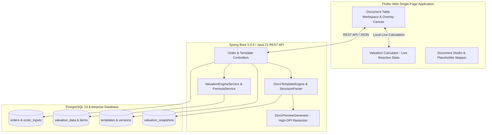
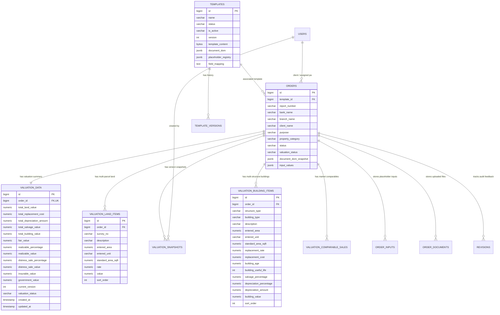

# ProValuer Commercial — System Architecture Handbook

**Version:** 2.0 (Post-Template Modernization & Rationalization)  
**Classification:** Enterprise Engineering & Maintenance Handbook  
**Target Audience:** Software Engineers, Solution Architects, DevOps, System Administrators, and Valuation Domain Experts  
**Last Updated:** September 2026

---

# Table of Contents
1. [Executive Summary & High-Level Architecture](#1-executive-summary--high-level-architecture)
2. [Database ER Diagram & Schema Architecture](#2-database-er-diagram--schema-architecture)
3. [Valuation Calculation Engine & Financial Formulas](#3-valuation-calculation-engine--financial-formulas)
4. [Complete Canonical Placeholder Catalog](#4-complete-canonical-placeholder-catalog)
5. [Dynamic Table Specifications (`LAND_TABLE`, `BUILDING_TABLE`, `VALUATION_SUMMARY_TABLE`)](#5-dynamic-table-specifications)
6. [Template Authoring Guide](#6-template-authoring-guide)
7. [DOCX Placeholder & Formatting Standards](#7-docx-placeholder--formatting-standards)
8. [Database Migration History (V1–V14)](#8-database-migration-history-v1v14)
9. [Backup & Disaster Recovery Procedures](#9-backup--disaster-recovery-procedures)
10. [Release History & Evolution Log](#10-release-history--evolution-log)
11. [Maintenance Runbook & Operational Procedures](#11-maintenance-runbook--operational-procedures)

---

# 1. Executive Summary & High-Level Architecture

ProValuer Commercial is an enterprise valuation workflow platform engineered for registered valuer entities (IBBI/RVE) and banking financial institutions (e.g., SBI, HDFC, ICICI). The platform manages the entire lifecycle of commercial asset appraisal: from order intake, field data collection, multi-parcel land and multi-structure building engineering computations, live web preview, and automated DOCX/PDF report compilation with embedded dynamic tables.



---

# 2. Database ER Diagram & Schema Architecture

The relational schema ensures strict relational integrity, multi-parcel dynamic support, and immutable snapshot capture.



---

# 3. Valuation Calculation Engine & Financial Formulas

All financial calculations follow the **International Valuation Standards (IVS)** and Indian Banking Association guidelines.

### 3.1 Land Valuation Formula
$$\text{Standard Area (Sq.Ft)} = \text{Entered Area} \times \text{Unit Conversion Factor}$$
$$\text{Parcel Value} = \text{Entered Area} \times \text{Rate}$$
$$\text{Total Land Value} = \sum_{i=1}^{n} \text{Parcel Value}_i$$

*Standard Conversion Factors:*
- `1 Sq.Yd` = $9.0\text{ Sq.Ft}$
- `1 Acre` = $43,560.0\text{ Sq.Ft}$
- `1 Gunta` = $1,089.0\text{ Sq.Ft}$
- `1 Hectare` = $107,639.104\text{ Sq.Ft}$

---

### 3.2 Building Valuation Formula (Straight Line Method with Salvage Floor Protection)

For each building structure item:
1. **Replacement Cost:**
   $$\text{Replacement Cost} = \text{Entered Area} \times \text{Replacement Rate}$$

2. **Depreciation Percentage:**
   $$\text{Depreciation \%} = \min\left(100.0 - \text{Salvage \%}, \left(\frac{\text{Age}}{\text{Useful Life}}\right) \times (100.0 - \text{Salvage \%})\right)$$

3. **Depreciation Amount:**
   $$\text{Depreciation Amount} = \text{Replacement Cost} \times \left(\frac{\text{Depreciation \%}}{100}\right)$$

4. **Salvage Floor Guard (Invariant):**
   $$\text{Salvage Floor} = \text{Replacement Cost} \times \left(\frac{\text{Salvage \%}}{100}\right)$$
   $$\text{Net Building Value} = \max\left(\text{Salvage Floor}, \text{Replacement Cost} - \text{Depreciation Amount}\right)$$

---

### 3.3 Consolidated Financial Summary Formulas

1. **Total Replacement Cost:**
   $$\text{Total Replacement Cost} = \sum \text{Building Replacement Cost}$$

2. **Total Building Value:**
   $$\text{Total Building Value} = \sum \text{Net Building Value}$$

3. **Fair Market Value:**
   $$\text{Fair Market Value} = \text{Total Land Value} + \text{Total Building Value}$$

4. **Realizable Sale Value (Typically 85%):**
   $$\text{Realizable Value} = \text{Fair Market Value} \times \left(\frac{\text{Realizable \%}}{100}\right)$$

5. **Distress Sale Value (Typically 75%):**
   $$\text{Distress Sale Value} = \text{Fair Market Value} \times \left(\frac{\text{Distress \%}}{100}\right)$$

6. **Insurable Value (Total Building Replacement Cost):**
   $$\text{Insurable Value} = \text{Total Replacement Cost} = \sum \text{Building Replacement Costs}$$
   *(Land value is strictly excluded from insurable value).*

7. **Government / Guideline Value:**
   $$\text{Government Value} = \text{Assessed Statutory / SRO Guideline Value}$$
   *(Independent statutory field; does not alter Fair Value).*

8. **Say Value (Presentation Rule):**
   $$\text{Say Value} = \begin{cases} \text{round}_{\text{Lakh}}(\text{Fair Value}), & \text{if Fair Value} \ge 1,00,00,000 \text{ (1 Crore)} \\ \text{Fair Value}, & \text{if Fair Value} < 1,00,00,000 \end{cases}$$
   *(Say Value is strictly a presentation figure and does not alter Realizable, Distress, Insurable, or Government values).*

---

# 4. Complete Canonical Placeholder Catalog

Placeholders can be written in either lowercase or uppercase inside Word templates.

### A. Dynamic Table Embed Tokens
| Placeholder Directive | Output Description |
| :--- | :--- |
| `<<LAND_TABLE>>` | Multi-parcel dynamic land breakdown with survey numbers, areas, rates, and totals |
| `<<BUILDING_TABLE>>` | Multi-structure dynamic building breakdown with SLM depreciation and net values |
| `<<VALUATION_SUMMARY_TABLE>>` | Consolidated 12-row certified summary breakdown table |
| `<<COMPARABLES_TABLE>>` | Comparable market sales analysis table |
| `<<PROPERTY_VALUE_TABLE>>` | Value of the Property table (Land, Building, Total Fair Value, Say Value) |

---

### B. Valuation Financial Figures & Banking Words
| Numeric Placeholder | Words Placeholder | Description |
| :--- | :--- | :--- |
| `<<total_land_value>>` | `<<total_land_value_words>>` | Sum of all land parcel valuations |
| `<<total_replacement_cost>>` | `<<total_replacement_cost_words>>` | Total replacement cost of all building structures |
| `<<total_depreciation_amount>>`| `<<total_depreciation_amount_words>>`| Total physical and economic depreciation |
| `<<total_salvage_value>>` | `<<total_salvage_value_words>>` | Total protected residual salvage floor |
| `<<total_building_value>>` | `<<total_building_value_words>>` | Depreciated net building market value |
| `<<fair_value>>` | `<<fair_value_words>>` | Total Fair Market Value (Land + Building) |
| `<<say_value>>` | `<<say_value_words>>` | Presentation Say Value rounded to nearest Lakh if $\ge$ 1 Crore |
| `<<realizable_value>>` | `<<realizable_value_words>>` | Assessed Realizable / Market Realization Value |
| `<<distress_sale_value>>` | `<<distress_sale_value_words>>` | Assessed Distress / Liquidation Sale Value |
| `<<insurable_value>>` | `<<insurable_value_words>>` | Insurable asset value (Replacement Cost) |
| `<<government_value>>` | `<<government_value_words>>` | SRO / Guideline statutory value |

---

### C. Order & Property Metadata Placeholders
| Placeholder | Description | Example Output |
| :--- | :--- | :--- |
| `<<report_no>>` | Unique certified valuation report reference number | `PV/HYD/COM/2026/0882` |
| `<<report_date>>` | Official date of issuance of the valuation report | `01-Sep-2026` |
| `<<inspection_date>>` | Physical site inspection date | `31-Aug-2026` |
| `<<owner_name>>` | Name of the registered property owner / title holder | `M/s Pravista Infra Pvt Ltd` |
| `<<client_name>>` | Financing Bank / Corporate Client Name | `State Bank of India` |
| `<<property_type>>` | Nature / Category of Property | `Commercial Office Complex` |
| `<<property_address>>` | Full postal and geographical address | `Plot 42, Financial District, Hyderabad` |
| `<<VRIN>>` | Valuer Registration Identification Number | `IBBI/RVE-E/01/2020/132` |

---

### D. Photograph Dropzone Placeholders
| Placeholder Key | Frame Description |
| :--- | :--- |
| `<<IMG_FRONT_PAGE>>` | Primary elevation / cover photo |
| `<<IMG_PIC1>>` to `<<IMG_PIC8>>` | Site inspection photographs 1 through 8 |

---

# 5. Dynamic Table Specifications

### Layout Invariants & XML Styling
Dynamic tables generated by `DocxTemplateEngine` enforce:
- **Table Layout:** `STTblLayoutType.FIXED` to avoid column drift across Word versions.
- **Header Formatting:** Dark Navy Background (`#003366`), Bold White Text (`#FFFFFF`), Center Aligned.
- **Row Alternation:** Clean white rows with subtle bottom borders (`#D3D3D3`).
- **Footer / Total Row:** Shaded Light Gray (`#F0F0F0`), Bold Navy Text.

---

# 6. Template Authoring Guide

When creating or modifying Microsoft Word (.docx) report templates:

1. **Use Angle Brackets:** Enclose all tokens in double angle brackets: `<<placeholder_name>>`.
2. **Avoid Splitting Runs in Word:** Type placeholders continuously without switching fonts or bolding halfway through a token. If Word splits runs across XML elements, the template engine normalizes them automatically, but clean authoring is best practice.
3. **Dynamic Table Directives:** Place `<<LAND_TABLE>>`, `<<BUILDING_TABLE>>`, or `<<VALUATION_SUMMARY_TABLE>>` in a standalone paragraph where the table should appear.
4. **Image Shapes:** To declare an image dropzone, create a shape or image frame in Word and set the Alt Text Title/Description to `IMG_FRONT_PAGE`, `IMG_PIC1`, etc.

---

# 7. DOCX Placeholder & Formatting Standards

- **Date Formatting:** Default date output follows `dd-MMM-yyyy` (e.g., `01-Sep-2026`).
- **Currency Grouping:** Indian Numbering System (Lakhs & Crores):
  - Example: `85,50,000` (85 Lakhs 50 Thousand), `1,02,50,000` (1 Crore 2 Lakhs 50 Thousand).
- **Banking Words Format:**
  - Prefix: `Rupees`
  - Suffix: `Only`
  - Title Case: `Rupees Eighty Five Lakh Fifty Thousand Only`.

---

# 8. Database Migration History (V1–V14)

| Migration File | Description |
| :--- | :--- |
| `V1__init_schema.sql` | Core schema (users, orders, revisions, performance_ledger, pricing_config, settings). |
| `V2__seed_admin.sql` | Default administrative users and system initialization seeds. |
| `V3__add_template_questions_dictionary.sql` | Placeholder questions dictionary table. |
| `V4__add_area_units.sql` | Units conversion table (`Sq.Ft`, `Sq.Yd`, `Acre`, `Gunta`, `Hectare`). |
| `V5__add_building_types.sql` | Building types lookup and default useful lives table. |
| `V6__add_structure_types.sql` | Structural classifications (`Ground Floor`, `First Floor`, `RCC`, etc.). |
| `V7__add_valuation_engine_tables.sql` | Core valuation tables (`valuation_data`, `valuation_land_items`, `valuation_building_items`, `valuation_snapshots`). |
| `V8__add_valuation_comparables.sql` | Market comparable sales table (`valuation_comparable_sales`). |
| `V9__add_valuation_audit_logs.sql` | Audit trail logging for valuation mutations (`valuation_audit_logs`). |
| `V10__document_workspace_engine.sql` | Document workspace snapshot and form slot bindings. |
| `V11__add_template_versions.sql` | Template version history and immutable rollback storage. |
| `V12__add_document_studio_config.sql` | Document Studio visual designer layout configs. |
| `V13__add_performance_indexes.sql` | Database performance indexes for sub-second retrieval. |
| `V14__add_insurable_and_government_values.sql` | Dedicated `government_value` and `insurable_value` columns with automated backfill. |

---

# 9. Backup & Disaster Recovery Procedures

### 9.1 Database Backup (PostgreSQL)
```powershell
# Create complete logical dump
pg_dump -U postgres -h localhost -p 5432 -F c -b -v -f "D:\naga\backups\provaluer_db_$(Get-Date -Format 'yyyyMMdd_HHmmss').dump" provaluer_db
```

### 9.2 Database Restore
```powershell
# Restore logical dump
pg_restore -U postgres -h localhost -p 5432 -d provaluer_db -v "D:\naga\backups\provaluer_db_YYYYMMDD_HHMMSS.dump"
```

### 9.3 Template Archival Manifest Verification
Whenever templates are retired, consult `D:\naga\archive_templates_20260901\manifest.json`. To restore an archived template:
```powershell
Copy-Item "D:\naga\archive_templates_20260901\Valuation Report.docx.bak" "D:\naga\Valuation Report.docx" -Force
```

---

# 10. Release History & Evolution Log

- **Release 1.0 (Foundation):** Core orders, single-rate static valuation, basic DOCX placeholder replacement.
- **Release 1.5 (Dynamic Valuation Architecture):** Multi-parcel land entries, multi-structure building SLM calculations, and salvage floor protection.
- **Release 2.0 (Modernized Production Integration):**
  - Adoption of `<<LAND_TABLE>>`, `<<BUILDING_TABLE>>`, and `<<VALUATION_SUMMARY_TABLE>>`.
  - Addition of dedicated `Insurable Value` ($=\text{Total Building Replacement Cost}$) and `Government Value`.
  - Canonical placeholder standardization and template rationalization.

---

# 11. Maintenance Runbook & Operational Procedures

### 11.1 Running Automated Validation Tests
```powershell
# Run backend test suite
cd "d:\Demo\Visadocs\ProValuer Commercial\backend"
.\gradlew.bat test

# Run frontend test suite
cd "d:\Demo\Visadocs\ProValuer Commercial\frontend"
flutter test
```

### 11.2 Adding a New Area Unit
1. Insert record into `area_units`:
   ```sql
   INSERT INTO area_units (unit_name, conversion_factor_sqft, is_active, created_at, updated_at) 
   VALUES ('Bigha', 14400.0, true, NOW(), NOW());
   ```
2. The `UnitConversionEngine` in the backend and `ValuationCalculator` in the frontend will automatically load the new unit factor.

### 11.3 Healthcheck & Diagnostics Endpoint
- Health: `GET /actuator/health`
- Metrics: `GET /actuator/metrics`
