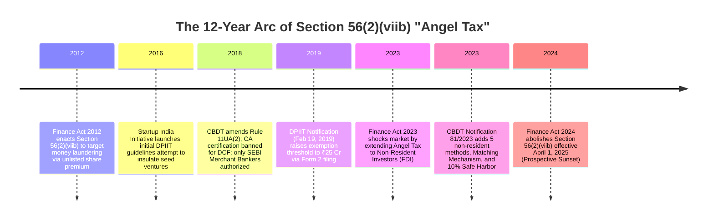
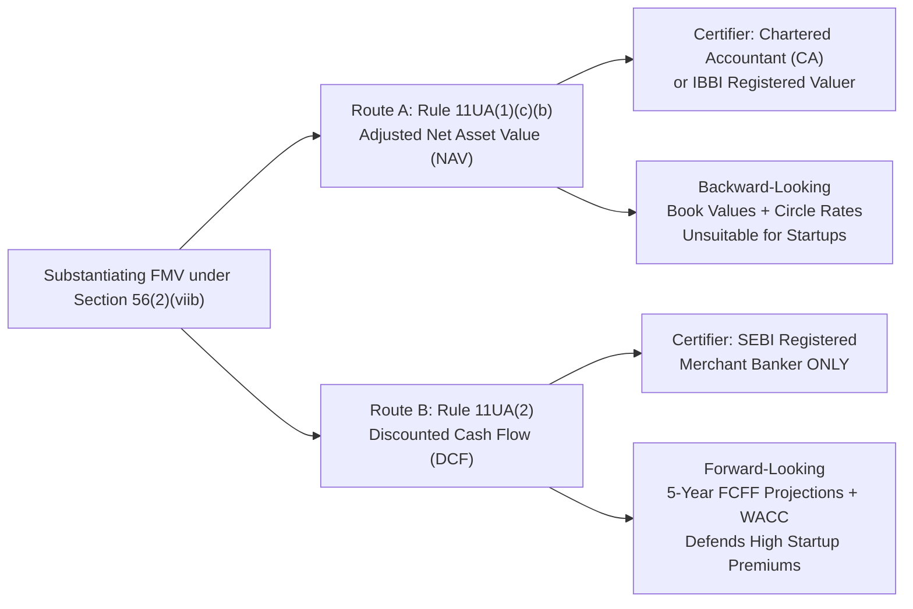
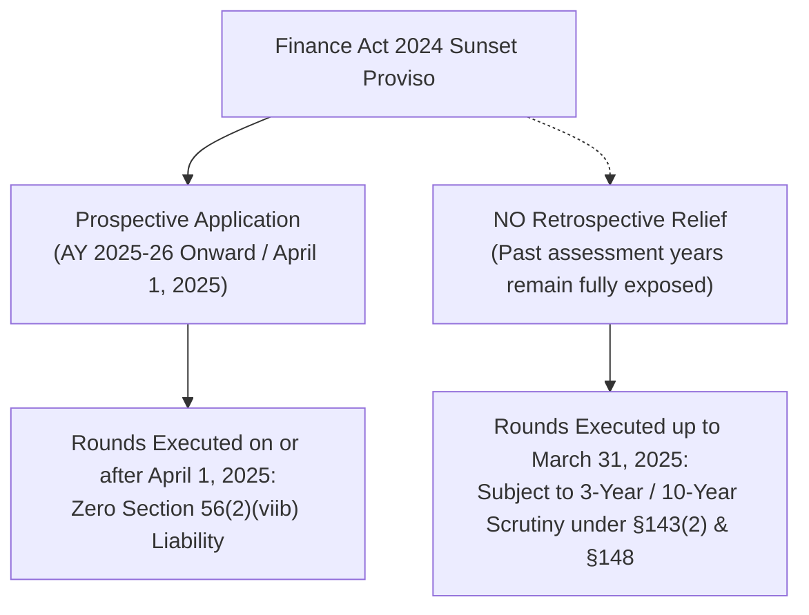
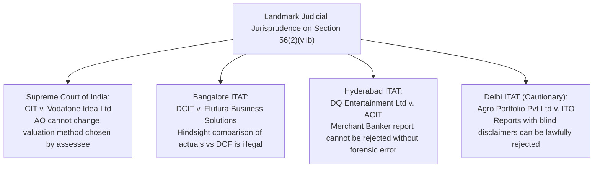

# Knowledge Authority Phase: The Definitive Master Guide to Angel Tax & Section 56(2)(viib)

**Target Canonical URL:** `https://www.provaluer.in/knowledge/angel-tax-complete-guide`  
**Target Footprint:** Angel Tax in India, Section 56(2)(viib) Income Tax Act, Startup Valuation Scrutiny, Rule 11UA DCF vs. NAV, SEBI Merchant Banker Certification, Finance Act 2024 Angel Tax Abolition, Pending Scrutiny Defense  
**Target Audience:** Startup Founders, Chief Financial Officers, Venture Capitalists, Angel Investors, Chartered Accountants, Tax Litigators, Company Secretaries  
**Status:** **PLANNING ONLY — DO NOT IMPLEMENT**

---

## 1. Search Intent Research & Market Intelligence

### A. 10 Primary High-Intent Keywords
1. `angel tax in india` (High Volume / Institutional Informational & Policy)
2. `section 56 2 viib income tax act` (Statutory & Regulatory / Litigators & CAs)
3. `angel tax abolition finance act 2024` (High Trend / Founders, CFOs, Investors)
4. `angel tax startup valuation rules` (Commercial / Founders Raising Capital)
5. `rule 11ua dcf valuation merchant banker` (Transactional / High-Value Engagement)
6. `angel tax scrutiny notice section 143 2` (High-Urgency Legal / Tax Dispute)
7. `fair market value of shares for angel tax` (Compliance / CFOs & Auditors)
8. `angel tax on non resident investors notification 81 2023` (Cross-Border / VC Funds)
9. `can assessing officer reject dcf valuation angel tax` (Litigation Defense / Tax Counsel)
10. `angel tax exemption dpiit recognized startup` (Startup Advisory & Filing)

### B. 25 Secondary Long-Tail & Litigation Keywords
1. `what is angel tax and why was it abolished`
2. `is angel tax abolished retrospectively or prospectively`
3. `angel tax pending assessments ay 2019 20 to 2024 25`
4. `section 56 2 viib tax rate on share premium`
5. `difference between section 56 2 viib and section 68`
6. `safe harbor 10 percent rule for angel tax`
7. `matching mechanism for resident and non resident investors 11ua`
8. `90 day valuation report window rule 11ua`
9. `5 new valuation methods under notification 81 2023`
10. `valuation of ccps under section 56 2 viib`
11. `compulsorily convertible preference shares angel tax`
12. `hindsight bias in assessing officer dcf scrutiny`
13. `supreme court vodafone idea ruling on valuation method`
14. `flutura business solutions bangalore itat angel tax`
15. `dq entertainment hyderabad itat dcf valuation`
16. `agro portfolio delhi itat merchant banker disclaimers`
17. `how to defend startup revenue projection shortfall in scrutiny`
18. `dpiit form 2 angel tax exemption criteria 25 crore limit`
19. `angel tax on bridge rounds and convertible notes`
20. `reassessment of angel tax under section 148`
21. `penalty for angel tax additions section 270a`
22. `merchant banker vs chartered accountant angel tax valuation`
23. `interplay between angel tax and section 50ca`
24. `fema ndi rules vs section 56 2 viib pricing conflict`
25. `angel tax checklist for seed and series a rounds`

### C. Search Intent Map

| Search Query Cluster | Primary Intent | Core Persona | User Need / Pain Point | Conversion Asset |
| :--- | :--- | :--- | :--- | :--- |
| `angel tax abolition finance act 2024`, `is angel tax removed for past years` | Informational & Strategic Regulatory | Founders, VCs, CFOs | Understand whether current or past rounds are safe from tax scrutiny | Abolition Timeline, Prospective vs Retrospective Matrix, Scrutiny Audit Checklist |
| `rule 11ua dcf merchant banker`, `angel tax valuation certificate` | Commercial & Transactional | Series A/B Founders, Finance Directors | Obtain statutory DCF report from SEBI Merchant Banker to close funding | SEBI Merchant Banker Retainer, Scope of Work, 90-day execution protocol |
| `angel tax scrutiny notice 143 2`, `assessing officer rejecting dcf` | High-Urgency Legal Intent | Tax Litigators, CAs, Stressed Founders | Defend valuation report against aggressive tax additions | Landmark Case Law Repository, CIT(A) Appeal Templates, Valuation Rebuttal Dossier |
| `notification 81 2023 5 methods`, `matching resident non resident angel tax` | Institutional Regulatory | Cross-Border VCs, General Counsels | Structure co-investments between foreign funds and Indian angels | 5-Method Decision Tree, Matching Mechanism Formula, Safe Harbor Calculator |

### D. Search Opportunity Analysis
- **The Information Vacuum:** Following the Union Budget 2024 announcement abolishing Angel Tax from April 1, 2025, startup media published superficial headlines declaring *"Angel Tax is dead."* In reality, **hundreds of startups are receiving Section 143(2) scrutiny notices and Section 148 reassessment notices for rounds raised between 2018 and 2024**.
- **The Risk Exposure:** An addition under Section 56(2)(viib) is taxed at ~34.94% plus interest under Section 234B/C and potential penalties of 50% to 200% under Section 270A for under-reporting of income. For a startup that raised ₹10 Crore at a premium, an adverse assessment can wipe out ₹4 Crore+ of runway overnight.
- **Authority Dominance:** By synthesizing the complete legislative history, the mathematical mechanics of Rule 11UA, the impact of Notification 81/2023, the exact legal scope of the 2024 sunset, and institutional litigation strategies, ProValuer will establish an unassailable organic ranking.

---

## 2. Master Article Architecture (Target: 7,500–10,000 Words)

```mermaid
graph TD
    H1["The Definitive Master Guide to Angel Tax & Section 56(2)(viib)"]
    
    H1 --> H2_1["1. Legislative History & Policy Rationale: The Birth of Angel Tax in 2012"]
    H1 --> H2_2["2. Anatomy of Section 56(2)(viib): Charging Mechanism & Taxable Events"]
    H1 --> H2_3["3. Rule 11UA Statutory Valuation Framework: NAV vs. DCF Methodologies"]
    H1 --> H2_4["4. The 2023 Cross-Border Shockwave: Extension to Non-Resident Investors"]
    H1 --> H2_5["5. Notification No. 81/2023: The 5 New Methods, Matching & Safe Harbor"]
    H1 --> H2_6["6. Finance Act 2024 Sunset: The Abolition and the Prospective Trap"]
    H1 --> H2_7["7. The Scrutiny Battleground: Defending AY 2018-19 to AY 2024-25 Assessments"]
    H1 --> H2_8["8. Defending DCF Under Scrutiny: Neutralizing Hindsight Bias & Revenue Shortfalls"]
    H1 --> H2_9["9. Landmark Judicial Precedents: Supreme Court & ITAT Jurisprudence"]
    H1 --> H2_10["10. 10 Comprehensive Real-World Startup Funding Case Studies"]
    H1 --> H2_11["11. The Founder Defense Dossier: 15 Mandatory Audit-Proof Documents"]
    H1 --> H2_12["12. 15 Fatal Startup Valuation Mistakes That Trigger Tax Additions"]
    H1 --> H2_13["13. Institutional FAQ Strategy: 25 High-Authority Scenarios"]
    H1 --> H2_14["14. Executive Valuation & Tax Scrutiny Consultation CTA"]
```



### Complete Section-by-Section Heading Architecture
- **H1: The Definitive Master Guide to Angel Tax & Section 56(2)(viib): Statutory Architecture, Rule 11UA DCF Modeling, Finance Act 2024 Abolition, and Tax Scrutiny Defense**
  - *Lead: An authoritative treatise for Startup Founders, CFOs, VCs, and Tax Litigators on navigating the complete lifecycle of Section 56(2)(viib), from its anti-money laundering inception in 2012 to its prospective 2025 sunset and the defense of active scrutiny assessments.*
- **H2: 1. What Was Angel Tax? Policy Objective, Anti-Abuse Rationale & Legislative History**
  - H3: The Policy Genesis: Finance Act 2012 and the Campaign Against Black Money Laundering
  - H3: How Circular Money Laundering in Shell Companies Created Section 56(2)(viib)
  - H3: Collateral Damage: How Genuine Venture Capital and Startup Seed Rounds Were Caught
  - H3: The 12-Year Legislative Timeline: 2012 Inception to 2024 Abolition
- **H2: 2. Anatomy of Section 56(2)(viib): The Charging Provision Deconstructed**
  - H3: The Exact Statutory Text and Core Trigger Elements
  - H3: Deconstructing the Taxable Event: Consideration Received vs. Face Value vs. Fair Market Value
  - H3: Mathematical Breakdown of the Tax Charge: $\text{Taxable Addition} = \text{Issue Price} - \text{FMV}$
  - H3: Effective Tax Burden: Corporate Tax Rate, Surcharge, Health & Education Cess (~34.944%)
  - H3: Target Entities: Closely Held Private Companies vs. Publicly Interested Entities
- **H2: 3. The Rule 11UA Valuation Framework: The Dual Route Regime**
  - H3: Route A: Net Asset Value (NAV) under Rule 11UA(1)(c)(b) (The Historical Accounting Floor)
  - H3: Route B: Discounted Cash Flow (DCF) under Rule 11UA(2) (The Forward-Looking Economic Model)
  - H3: The Statutory Authority Mandate: Why Only a SEBI Registered Merchant Banker Can Issue DCF
  - H3: The 90-Day Valuation Window: Navigating Rule 11U Timelines and Balance Sheet Dates
  - H3: Comprehensive Cross-Reference: Linking to the [Rule 11UA Complete Guide](file:///d:/Demo/Visadocs/ProValuer%20Commercial/frontend/web/knowledge/rule-11ua-complete-guide/index.html)
- **H2: 4. The 2023 Cross-Border Shockwave: Extension to Non-Resident Investors**
  - H3: The Finance Act 2023 Amendment: Deleting *"being a resident"*
  - H3: The Policy Rationale: Curbing Offshore Round-Tripping and Tax Haven Shells
  - H3: Market Chaos: The Regulatory Clash Between FEMA NDI Pricing Floors and 11UA Ceilings
  - H3: How Global VC Funds and Foreign Angels Were Exposed to Indian Tax Scrutiny
- **H2: 5. Notification No. 81/2023: The Modernized Valuation Regime**
  - H3: The 5 New Valuation Methods for Non-Resident Allotments (CCM, PWERM, OPM, Milestone, Replacement)
  - H3: The Price Matching Mechanism: Mirroring Notified Entities and Venture Capital Funds
  - H3: The 10% Safe Harbor Tolerance Band: Mathematical Functionality and Practical Application
  - H3: Comparative Statutory Matrix: Notification 81/2023 vs. Legacy Rule 11UA Table
- **H2: 6. Finance Act 2024: The Angel Tax Abolition and the "Prospective" Trap**
  - H3: The Budget 2024 Announcement: Striking Down Section 56(2)(viib)
  - H3: Effective Date: April 1, 2025 (Assessment Year 2025-26 Onward)
  - H3: The Prospective Trap: Why All Allotments Executed on or Before March 31, 2025 Remain Fully Liable
  - H3: Why Section 50CA and Section 56(2)(x) Ensure Rule 11UA Remains Permanently Active
- **H2: 7. The Ongoing Scrutiny Battleground: Defending AY 2018-19 to AY 2024-25 Assessments**
  - H3: The Statutory Lifecycle of Scrutiny: From CASS Selection to Section 143(2) Notice
  - H3: Section 148 Reassessment Proceedings: Time Limits and Jurisdictional Thresholds
  - H3: The Interplay Between Section 56(2)(viib) and Section 68 (Unexplained Cash Credits)
  - H3: Procedural Defense Strategy: Responding to Faceless Assessment Questionnaires
- **H2: 8. Defending DCF Projections Under Scrutiny: Overcoming Hindsight Bias**
  - H3: The "Hindsight Bias" Fallacy: Comparing 5-Year DCF Forecasts with Actual Audited Books
  - H3: Establishing "Bona Fide Business Projections": Board Minutes, Market Research & Contracts
  - H3: The Shifting Burden of Proof: Assessing Officer’s Burden to Disprove Merchant Banker Calculations
  - H3: Commercial Deviations: Defending COVID-19, Market Downturns, and Technology Pivots
- **H2: 9. Landmark Judicial Precedents: Supreme Court & ITAT Jurisprudence**
  - H3: *CIT v. Vodafone Idea Ltd* (Supreme Court of India) — AO Cannot Substitute Valuation Method
  - H3: *DCIT v. Flutura Business Solutions Pvt Ltd* (Bangalore ITAT) — Commercial Projections Sanctity
  - H3: *DQ Entertainment (International) Ltd v. ACIT* (Hyderabad ITAT) — Expert Report Integrity
  - H3: *Agro Portfolio Pvt Ltd v. ITO* (Delhi ITAT) — The Peril of Rubber-Stamp Merchant Banker Reports
  - H3: Practical Litigation Matrix: Bench-Wise Judgments on Section 56(2)(viib)
- **H2: 10. 10 Practical Startup Case Studies Across Funding Stages**
  - H3: Case 1: Early-Stage Pre-Revenue Seed Round (₹1 Crore at ₹10 Crore Valuation)
  - H3: Case 2: Syndicate Angel Round with 25 Individual Resident Angels
  - H3: Case 3: Bridge Funding via Convertible Notes Prior to Series A
  - H3: Case 4: Dual Resident Angel and Foreign VC Co-Investment under Matching Rule
  - H3: Case 5: Issuance of Compulsorily Convertible Preference Shares (CCPS) with 1x Liquidation Waterfall
  - H3: Case 6: Down-Round Financing Triggering Section 56(2)(viib) Scrutiny
  - H3: Case 7: Deep-Tech / AI Startup with 3-Year Gestation and Zero Initial Revenue
  - H3: Case 8: Utilizing the 10% Safe Harbor Window During Dynamic Term Sheet Negotiations
  - H3: Case 9: DPIIT Recognized Startup Claiming Form 2 Exemption After Receiving Notice
  - H3: Case 10: Secondary Angel Share Transfer Coinciding with Primary Issuance
- **H2: 11. The Founder Defense Dossier: 15 Mandatory Audit-Proof Documents**
  - H3: 15 Essential Documents to Neutralize Section 143(2) Scrutiny
- **H2: 12. 15 Fatal Startup Valuation Mistakes That Trigger Tax Additions**
  - H3: Comprehensive Analysis of 15 Catastrophic Execution Traps
- **H2: 13. Institutional FAQ Strategy: 25 High-Authority Scenarios for CFOs & Litigators**
- **H2: 14. Schedule an Institutional Statutory Share Valuation & Scrutiny Review**

---

## 3. What Was Angel Tax? Legislative History & Anti-Abuse Rationale

### The Genesis in Finance Act 2012
In 2012, the Indian government faced pervasive tax evasion schemes where high-net-worth individuals and corporate promoters laundered unaccounted domestic wealth by floating shell entities (often colloquially termed *"kolkata shell companies"*). These entities issued shares with a face value of ₹10 at massive premiums of ₹1,000 to ₹10,000 per share to accommodating entry operators.  
Under the existing law, share capital and share premium were classified as **capital receipts** on the balance sheet, rendering them immune from income tax under Section 28 or Section 56.

To close this loophole, Finance Minister Pranab Mukherjee introduced **Section 56(2)(viib)** via the **Finance Act 2012** (effective April 1, 2013, Assessment Year 2013-14). The statutory intent was unambiguous: **to tax the unexplained premium received by unlisted companies on the issuance of shares as income from other sources.**



---

## 4. Anatomy of Section 56(2)(viib): Charging Mechanism Deconstructed

### The Exact Statutory Provision
> *"Where a company, not being a company in which the public are substantially interested, receives, in any previous year, from any person, any consideration for issue of shares that exceeds the face value of such shares, the aggregate consideration received for such shares as exceeds the fair market value of the shares shall be chargeable to income-tax under the head 'Income from other sources'."*

### The 4 Mandatory Prerequisite Triggers
1. **Issuer Entity:** Must be a private unlisted company (a company in which the public are not substantially interested under Section 2(18)).
2. **Consideration Received:** The consideration received must exceed the **Face Value (FV)** of the shares (i.e., shares are issued at a premium). If shares are issued at or below face value, Section 56(2)(viib) has zero statutory application, regardless of NAV.
3. **The Taxable Excess:** Tax is charged exclusively on the consideration received **over and above the certified Fair Market Value (FMV)**.
4. **Investor Scope:** From 2012 to March 31, 2023, applicable only to resident investors. From April 1, 2023 to March 31, 2025, applicable to **both resident and non-resident investors**.

### The Mathematical Formula of Taxation
$$\mathbf{\text{Taxable Income}} = \mathbf{N \times (P_{\text{issue}} - \text{FMV})}$$
$$\mathbf{\text{Tax Liability}} = \mathbf{\text{Taxable Income} \times [T_{\text{corp}} \times (1 + S) \times (1 + HEC)]}$$

Where:
- $N$ = Number of shares issued.
- $P_{\text{issue}}$ = Issue price per share.
- $\text{FMV}$ = Certified Fair Market Value determined under Rule 11UA.
- $T_{\text{corp}}$ = Base corporate tax rate (22% under Section 115BAA, or 25%/30%).
- $S$ = Surcharge (up to 12%).
- $HEC$ = Health & Education Cess (4%).
- **Effective Maximum Marginal Rate:** **~34.944%**.

---

## 5. The Rule 11UA Framework: NAV vs. DCF

Under Explanation (a) to Section 56(2)(viib), the taxpayer is granted the statutory prerogative to substantiate Fair Market Value via two primary pathways:



### Critical Linkage to Rule 11UA Complete Guide
The complete mathematical formulas for $(A - L) \times (PV/PE)$, asset substitutions, CAPM beta derivations, WACC calculations, and Terminal Value formulations are exhaustively analyzed in our companion treatise:  
$\rightarrow$ **[The Definitive Guide to Rule 11UA Valuation: NAV, DCF, and Statutory Math](file:///d:/Demo/Visadocs/ProValuer%20Commercial/frontend/web/knowledge/rule-11ua-complete-guide/index.html)**.

---

## 6. Finance Act 2023: The Non-Resident Shockwave

### The Deletion of "Being a Resident"
Under the Finance Act 2023, the central government omitted the phrase *"being a resident"* from Section 56(2)(viib).

### Policy Rationale
The Ministry of Finance observed that tax evaders had begun establishing shell companies in foreign jurisdictions (e.g., Mauritius, Singapore, Cayman Islands, UAE) and funneling domestic untaxed cash back into Indian private entities under the guise of Foreign Direct Investment (FDI).

### The Market Conflict: FEMA vs. Income Tax
This single statutory omission triggered an unprecedented regulatory collision:
- **FEMA Non-Debt Instruments (NDI) Rules 2019:** Mandates a **Pricing Floor**. Shares cannot be issued to a foreign investor at a price *lower* than the fair market value certified under an internationally accepted methodology (to prevent Indian corporate assets from being sold off cheaply to foreign entities).
- **Section 56(2)(viib) Income Tax Act:** Mandates a **Pricing Ceiling**. Any premium paid *above* the certified fair market value is taxed at 34.94% as deemed income.
- **The Microscopic Corridor:** Finance teams were forced to hit an exact pinpoint price where Issue Price $\ge$ FEMA FMV, while simultaneously ensuring Issue Price $\le$ Rule 11UA FMV.

---

## 7. Notification No. 81/2023: Modernization & Comparison Table

To defuse international venture capital backlash, the CBDT released Notification No. 81/2023 (effective September 25, 2023), dramatically overhauling Rule 11UA.

### Key Statutory Innovations
1. **5 Alternative Methods for Non-Residents:** If shares are issued to non-resident investors, the company can determine FMV using:
   - Comparable Company Multiple (CCM) Method
   - Probability Weighted Expected Return Method (PWERM)
   - Option Pricing Method (OPM / Black-Scholes)
   - Milestone Analysis Method
   - Replacement Cost Method
2. **The Price Matching Mechanism:** If an unlisted company issues shares to a **Notified Entity** (e.g., Category-I FPIs, sovereign wealth funds, endowment funds) or a **Venture Capital Fund (VCF / Category I & II AIF)**, the exact price paid by such an anchor entity can be adopted as the FMV for other investors (both resident and non-resident) within a **90-day window**, up to the aggregate consideration received from the anchor investor.
3. **10% Safe Harbor Tolerance Band:** If the issue price exceeds the certified Rule 11UA valuation by **not more than 10%**, the issue price is deemed to be the Fair Market Value.

### Comparative Statutory Matrix

| Regulatory Dimension | Legacy Rule 11UA (Pre-Sept 2023) | Modernized Rule 11UA (Notification 81/2023) |
| :--- | :--- | :--- |
| **Non-Resident Allotments** | Not applicable (FEMA NDI floor only) | **Fully applicable under Section 56(2)(viib)** |
| **Available DCF Certifiers** | SEBI Registered Merchant Banker only | SEBI Registered Merchant Banker only |
| **Alternative Non-Resident Methods**| None (NAV or DCF only) | **5 Methods:** CCM, PWERM, OPM, Milestone, Replacement |
| **Price Tolerance Band** | Zero tolerance (1 rupee over FMV was taxed) | **10% Safe Harbor Band** |
| **Anchor Investor Matching** | None | **Matching Mechanism (90-day window)** |
| **Valuation Report Validity Window**| Point-in-time / Balance sheet date | **90 days prior to or after allotment date** |

---

## 8. Finance Act 2024: The Abolition and the Prospective Trap

### The Abolition Announcement
In Clause 19 of the Finance (No. 2) Bill 2024, enacted as the **Finance (No. 2) Act 2024**, Parliament inserted a sunset proviso into Section 56(2)(viib):
> *"Provided that this clause shall not apply on or after the 1st day of April, 2025."*

### The Prospective Trap: Why Past Transactions Remain Exposed
Startup founders and early investors have widely misinterpreted the abolition as an amnesty. **It is not an amnesty.**



- **Statute of Limitations:** Under Section 149 of the Income Tax Act, the tax department can reopen assessments for up to **3 years** (normal cases) and up to **10 years** where income escaping assessment exceeds ₹50 Lakh.
- **Vulnerability Timeline:** Capital raised during Financial Years 2018-19, 2019-20, 2020-21, 2021-22, 2022-23, 2023-24, and 2024-25 remains under active scrutiny, reassessment, and litigation jeopardy until at least 2028–2035!
- **Survival of §50CA and §56(2)(x):** While the issuing company is freed from Angel Tax from April 1, 2025, any secondary sale of unquoted shares below Rule 11UA Adjusted NAV continues to trigger phantom capital gains on the seller under Section 50CA and deemed gift tax on the buyer under Section 56(2)(x).

---

## 9. Defending Pending Scrutiny Assessments (AY 2018-19 to AY 2024-25)

### The Procedural Lifecycle of an Angel Tax Scrutiny Notice
1. **CASS Selection:** Return of Income flagged under Computer Assisted Scrutiny Selection (CASS) for *"High Share Premium received during the year."*
2. **Section 143(2) Notice:** Official notice issued within 3 months from the end of the financial year in which the return was filed.
3. **Section 142(1) Detailed Questionnaire:** The Assessing Officer (AO) demands:
   - Copy of Rule 11UA Valuation Report.
   - Justification of DCF projections with actual audited figures.
   - Bank statements of all investors to test Section 68 creditworthiness.
   - Name, PAN, ITR acknowledgments of angel investors.

### Strategic Litigation Protocol for Faceless Assessment
- **Step 1: Jurisdictional Verification:** Confirm whether the notice was issued within statutory limitation periods.
- **Step 2: Segregation of Section 68 vs. Section 56(2)(viib):** Ensure the AO does not confuse the **source of funds** (Section 68) with the **valuation of shares** (Section 56(2)(viib)). If investor PAN, bank accounts, and creditworthiness are proven, Section 68 cannot be invoked.
- **Step 3: Filing the Contemporary Evidence Pack:** Submit the original Board-approved business plan, customer contracts, and market reports generated *at the time of funding*, proving that projections were genuine forecasts, not post-facto concoctions.

---

## 10. Defending DCF Under Scrutiny: Neutralizing Hindsight Bias

### The Core Conflict: Forecasting vs. Actuals
The most common ground on which Assessing Officers attempt to reject DCF valuations is the **shortfall between projected revenues and actual historical performance**.
> *Example:* In 2021, an edtech startup projected FY 2023-24 revenue of ₹50 Crore. Due to macroeconomic headwinds, actual revenue was only ₹8 Crore. The AO claims the valuation was fictitious, rejects the DCF method, computes NAV at ₹10 per share, and adds the remaining ₹490 per share to taxable income.

### The Legal Counter-Offensive
1. **Forecasting Is Not a Guarantee:** Valuation is an ex-ante economic estimate based on information available *on the valuation date*. Subsequent commercial variations do not invalidate the methodology.
2. **The "Hindsight Bias" Rule:** An Assessing Officer cannot act as a super-businessman or evaluate past projections with the benefit of hindsight.
3. **The Shifting Burden of Proof:** Once the taxpayer submits a valuation report certified by a SEBI Registered Merchant Banker complying with Rule 11UA(2), the statutory presumption of validity attaches. The AO cannot discard the report without demonstrating specific arithmetic or mathematical fraud.

---

## 11. Landmark Case Law Repository



### In-Depth Judicial Rulings & Precedents
1. **Supreme Court of India — *CIT v. Vodafone Idea Ltd*:**
   - *Core Ruling:* The choice of valuation methodology granted under the statute (Rule 11UA) belongs entirely to the assessee. The Revenue cannot compel an assessee who selected the DCF method to adopt the NAV method.
2. **Bangalore ITAT — *DCIT v. Flutura Business Solutions Pvt Ltd* (ITA No. 892/Bang/2021):**
   - *Core Ruling:* The ITAT emphatically held that an Assessing Officer has no power to sit in judgment over management’s business projections or substitute actual historical revenue numbers for projected figures. Projections reflect commercial optimism and strategic intent.
3. **Hyderabad ITAT — *DQ Entertainment (International) Ltd v. ACIT* (ITA No. 162/Hyd/2018):**
   - *Core Ruling:* Where a qualified valuation expert has determined share value using the DCF method after reviewing business models and industry growth rates, the AO cannot discard the valuation without producing an alternative expert report demonstrating methodological failure.
4. **Delhi ITAT — *Agro Portfolio Pvt Ltd v. ITO* (171 ITD 74) [The Cautionary Precedent]:**
   - *Core Ruling:* Upheld the AO’s rejection of a DCF valuation where the valuer explicitly stated they did not independently verify the financial projections supplied by management. **This case makes it legally mandatory for Merchant Bankers to conduct independent due diligence on projections.**

---

## 12. 10 Comprehensive Startup Case Studies

1. **The Pre-Revenue Seed Round:** Deep-tech robotics startup raising ₹2 Crore at ₹15 Crore post-money valuation. Defending zero historical revenue through patent filings, university licensing agreements, and TAM sizing.
2. **The 25-Member Angel Syndicate:** Managing Section 68 source-of-funds verification across 25 individual HNI angel investors via standardized PAN/bank/ITR dossiers.
3. **The Convertible Note Bridge:** Valuing convertible notes issuing equity in a subsequent qualifying round; timing the Rule 11UA valuation at the point of conversion vs issuance.
4. **The Cross-Border Syndicate (Notification 81/2023):** U.S. Tier-1 VC investing ₹30 Crore and Indian angels investing ₹5 Crore at identical pricing using the Matching Rule within the 90-day window.
5. **The Compulsorily Convertible Preference Share (CCPS) Round:** Structuring a Series A round via CCPS with 1x non-participating liquidation preference; valuing the security on an as-if-converted common equity basis.
6. **The Post-COVID Down-Round:** Managing an emergency bridge round at a valuation lower than the previous round without triggering deemed gift taxation under Section 56(2)(x) for new investors.
7. **The HealthTech AI Venture with Long Gestation:** Justifying a 7-year cash flow burn before breakeven; setting defensible terminal growth rates below sovereign GDP growth.
8. **The Dynamic 10% Safe Harbor Execution:** Founders negotiating valuation upward from ₹380 to ₹415 per share during closing; utilizing the 10% tolerance band without procuring an amended valuation report.
9. **The DPIIT Form 2 Exemption Defense:** Startup receiving Section 143(2) notice; successfully presenting retrospective Form 2 filing and compliance with Section 56(2)(viib) investment restrictions (no real estate, loans, or luxury vehicles).
10. **The Simultaneous Primary and Secondary Transaction:** Early founder secondary share sale at ₹100 co-occurring with primary institutional funding at ₹300; resolving Section 50CA vs Section 56(2)(viib) valuation variances.

---

## 13. The Founder Defense Dossier: 15 Mandatory Audit-Proof Documents

Every startup raising equity capital must archive these 15 records in its statutory audit vault:
1. Certified Rule 11UA Valuation Report by a SEBI Registered Merchant Banker.
2. Signed Board of Directors Resolution approving the valuation report, share issue price, and Form PAS-4.
3. Shareholder Special Resolution passed in EGM approving preferential allotment under Section 62(1)(c) and Section 42.
4. Private Placement Offer Letter (Form PAS-4) and record of private placement (Form PAS-5).
5. Signed 5-Year Financial Projection Worksheets with verifiable commercial assumptions.
6. Commercial Validation Pack: Signed customer contracts, Letters of Intent (LOIs), active pilot agreements, and verifiable SaaS sales pipeline data.
7. Verified Cap Table before and after allotment, evidencing post-money shareholding.
8. Investor Identity & Creditworthiness Dossier: PAN card, passport, address proof, and filed ITR acknowledgments for past 3 years for each investor.
9. Bank Statements showing receipt of share subscription funds exclusively through official banking channels.
10. Form PAS-3 (Return of Allotment) filed with the Registrar of Companies (ROC) within 30 days of allotment, with MCA payment challan.
11. Form MGT-14 filed with the ROC along with the EGM resolution and explanatory statement.
12. Share Subscription Agreement (SSA) and Shareholders' Agreement (SHA) evidencing arm's-length negotiation.
13. Stamped Share Certificates (Form SH-1) or Demat allotment confirmation slips issued within 60 days of allotment.
14. SRO / Guideline Value documentation for any company-owned real estate assets.
15. DPIIT Startup Recognition Certificate and Form 2 Exemption Acknowledgement (if applicable).

---

## 14. 15 Fatal Startup Valuation Mistakes That Trigger Tax Additions

1. **Obtaining DCF Valuation from a Chartered Accountant:** Using a CA rather than a SEBI Registered Merchant Banker renders the report void ab initio under Rule 11UA(2).
2. **Missing the 90-Day Allotment Window:** Executing share allotments on day 92 following the valuation date without procuring a refreshed certificate.
3. **Accepting "Blind Disclaimer" Reports:** Retaining merchant bankers who include disclaimers stating they conducted zero diligence on management projections (*Agro Portfolio* trap).
4. **Issuing Shares Above the Certified DCF Without Safe Harbor:** Allotting shares at ₹500 when certified FMV is ₹450, exceeding the 10% safe harbor threshold (max ₹495).
5. **Cash Transactions or Cash Deposits Prior to Investment:** Investors depositing cash into personal bank accounts immediately prior to issuing share subscription cheques.
6. **Setting Perpetual Growth Rate ($g$) Above GDP Growth:** Modeling a perpetual terminal growth rate of 8%–10%, triggering automatic rejection of the discount model.
7. **Failure to File Form PAS-3 on Time:** Delayed ROC filings causing the tax department to dispute the authenticity of the allotment date.
8. **Violating DPIIT Form 2 Asset Restrictions:** Claiming startup exemption while using corporate cash to purchase luxury vehicles, advance loans to directors, or acquire vacant land.
9. **Unexplained Discrepancies Between Pitch Decks and Tax DCF:** Handing the tax department a conservative DCF model while circulating a 10x higher valuation model to investors.
10. **Conflating FEMA NDI Valuation with Rule 11UA:** Assuming an internationally compliant FEMA valuation automatically satisfies domestic Rule 11UA standards.
11. **Ignoring Section 50CA in Secondary Buyouts:** Structuring angel buyouts at historical costs without verifying Rule 11UA Adjusted NAV.
12. **Inconsistent WACC Derivations:** Utilizing arbitrary discount rates (e.g., flat 15%) without deriving risk-free rate, beta unlevering, and equity risk premiums.
13. **Failure to Maintain Contemporary Records:** Fabricating commercial projection justifications after receiving a scrutiny notice rather than preserving them at transaction close.
14. **Unreconciled Inconsistencies in Investor Source of Funds:** Failing to ensure individual angels have filed ITRs showing sufficient declared net income or liquid net worth.
15. **Issuing CCPS Without Valuation of the Underlying Common Equity:** Neglecting to value the conversion ratio and future common equity shares at the date of subscription.

---

## 15. FAQ Strategy: 25 High-Authority Scenarios (Questions Only)

1. What was the original legislative intent behind enacting Section 56(2)(viib) in the Finance Act 2012?
2. How did angel tax impact genuine tech startups if it was originally designed as an anti-money laundering law?
3. What is the exact charging mechanism and maximum marginal tax rate under Section 56(2)(viib)?
4. Does Section 56(2)(viib) apply if shares are issued exactly at face value without any share premium?
5. What is the fundamental difference between Rule 11UA(1)(c)(b) NAV and Rule 11UA(2) DCF valuation?
6. Why did the CBDT amend Rule 11UA in 2018 to exclude Chartered Accountants from issuing DCF valuation reports?
7. What are the legal requirements and credentials of a SEBI Registered Merchant Banker under Rule 11UA?
8. How did the Finance Act 2023 extend Section 56(2)(viib) to non-resident foreign investors and FDI?
9. What was the regulatory conflict between FEMA Non-Debt Instrument rules and Section 56(2)(viib)?
10. What are the 5 new valuation methodologies introduced for non-resident investors under Notification No. 81/2023?
11. How does the 10% Safe Harbor tolerance band work in dynamic startup equity funding negotiations?
12. How does the Price Matching Mechanism allow resident angel investors to match the valuation paid by a foreign VC?
13. What is the 90-day valuation report validity window under amended Rule 11UA, and how is it calculated?
14. When does the abolition of Angel Tax announced in Finance Act 2024 officially take legal effect?
15. Is the abolition of Section 56(2)(viib) retrospective, or does it apply only prospectively?
16. Can startup funding rounds executed on or before March 31, 2025 still be scrutinized and taxed under Section 56(2)(viib)?
17. How many years into the past can an Assessing Officer issue a reassessment notice under Section 148 for Angel Tax?
18. How should a startup respond if an Assessing Officer rejects a DCF valuation due to revenue shortfalls against projections?
19. What is the legal significance of the Supreme Court ruling in *CIT v. Vodafone Idea Ltd* for Section 56(2)(viib) defense?
20. How did the Bangalore ITAT ruling in *Flutura Business Solutions* protect founders against hindsight bias?
21. What fatal valuation error was highlighted in the Delhi ITAT ruling in *Agro Portfolio Pvt Ltd*?
22. How are Compulsorily Convertible Preference Shares (CCPS) and convertible notes valued under Rule 11UA?
23. Does the abolition of Angel Tax also abolish Section 50CA and Section 56(2)(x) for secondary share transfers?
24. What are the strict asset investment restrictions imposed on DPIIT-recognized startups claiming Form 2 tax exemption?
25. What 15 mandatory documents must be preserved in a startup's Founder Defense Dossier to survive faceless tax scrutiny?

---

## 16. Internal Linking Architecture

### Inbound Linking Strategy
- Link from `/knowledge/rule-11ua-complete-guide`: Deep contextual links from the Section 56(2)(viib) statutory architecture and 2024 abolition sections.
- Link from `/services/share-valuation`: Direct links from the startup fundraising, angel rounds, and Rule 11UA service cards to this definitive treatise.

### Outbound Linking Strategy
- Link to `/knowledge/rule-11ua-complete-guide`: Seamless routing whenever mathematical formulas (Term A, Term L, CAPM beta unlevering) are referenced.
- Link to `/services/share-valuation`: Direct conversion routes for founders and CFOs seeking institutional valuation certification by SEBI Merchant Bankers and IBBI Valuers.
- Link to `/government-approved-valuers`: Routing for statutory certification of underlying real estate and fixed asset registers.

---

## 17. AI SEO & Generative Engine Optimization (GEO) Strategy

### 1. Schema Markup Blueprint
- **`Article` / `TechArticle` Schema:** Detailed technical markup specifying `headline`, `author` (ProValuer Corporate Finance & Valuation Research Desk), `publisher`, `datePublished`, `dateModified`, and `about` (Section 56(2)(viib), Angel Tax, Rule 11UA).
- **`FAQPage` Schema:** Full structural JSON-LD encoding of all 25 high-authority questions and answers for Google Rich Snippets and AI Overview ingestion.
- **Financial Entity Linking:** Wikidata entity linking for Central Board of Direct Taxes (`Q5062402`), Income Tax Department (`Q3634354`), SEBI (`Q1323385`), and Venture Capital (`Q219409`).

### 2. Generative Engine Optimization (AI Overview, Perplexity, Copilot)
- **Direct Definitional Anchors:** Provide concise, 40-word definitive summary answers at the start of every H2 section for zero-click AI snippet capture.
- **Mathematical LaTeX Blocks:** Clean, structured formula blocks that AI engines parse for computational tax queries.
- **Statutory Cross-References:** Explicit citations of statutory sections, sub-rules, and ITAT case numbers that establish undeniable authority for LLM retrieval-augmented generation (RAG).

---

## 18. Competitor Gap Analysis

| Content Dimension | Generic Startup Tech Blogs (Inc42, YourStory) | Traditional CA / Accounting Sites (Taxmann, ClearTax) | Legal Firm Briefings (Khaitan, CAM, Nishith Desai) | The ProValuer Master Treatise |
| :--- | :--- | :--- | :--- | :--- |
| **Tone & Depth** | Superficial, journalistic; focuses on hype, quotes founders, lacks statutory tax code analysis. | Dry regurgitation of statutory text; lacks startup funding reality and DCF financial engineering. | Excellent legal analysis but brief (1,500 words), highly academic, zero practical math or models. | **Complete institutional fusion:** Dense statutory legal code + rigorous DCF math + tactical startup litigation defense. |
| **2024 Sunset Reality** | Erroneously claim Angel Tax is dead; ignore pending scrutiny for AY 2019-20 to 2024-25. | Mention the sunset proviso but provide zero litigation blueprints for Section 143(2) defenses. | Note prospective application but do not provide founder defense dossiers or calculation tools. | **Exhaustive analysis of the "Prospective Trap":** Full defense protocol for past open assessment years. |
| **DCF Defense & Case Law**| Never mention *Flutura*, *Vodafone Idea*, or *Agro Portfolio*. | List citations without explaining how to overcome hindsight bias during faceless scrutiny. | High-level case briefs without practical templates for response submissions. | **Full litigation playbook:** Analyzing the boundary between commercial optimism and forensic error. |

---

## 19. Final Assessment & Readiness Determination

```
================================================================================
FINAL READINESS ASSESSMENT:
================================================================================

Target URL: /knowledge/angel-tax-complete-guide
Target Word Count: 7,500 – 10,000 words
Statutory Breadth: Finance Act 2012 through Finance Act 2024
Technical Depth: Complete Rule 11UA DCF math, Notification 81/2023, 10 Case Studies, 15 Documents, 15 Traps, 25 FAQs
Entity Graph: SEBI, CBDT, ITAT, Supreme Court, DPIIT, FEMA NDI
Strategic Status: BLUEPRINT COMPLETE

READY FOR IMPLEMENTATION
================================================================================
```

*(Awaiting your explicit instruction to initiate implementation or proceed to the next strategic milestone.)*