# Institutional Technical Blueprint: The Definitive Guide to NCLT Valuation in India

**Target Canonical URL:** `https://www.provaluer.in/knowledge/nclt-valuation-complete-guide`  
**Target Footprint:** NCLT Valuation, National Company Law Tribunal, Registered Valuer, IBBI Valuation, Companies Act 2013, Section 247, Merger Valuation, Demerger Valuation, Oppression & Mismanagement, Minority Shareholder Exit, Fair Value Determination, Share Exchange Ratio, Insolvency Valuation, Going Concern Value, Liquidation Value, Scheme of Arrangement  
**Target Audience:** Corporate Lawyers, Company Secretaries (CS), Chartered Accountants (CA), IBBI Registered Valuers, Chief Financial Officers (CFOs), Promoters, Private Equity & Venture Capital Funds, Insolvency Professionals (IPs / RPs), Resolution Applicants, NCLT Litigants  
**Status:** **PLANNING ONLY — DO NOT IMPLEMENT**

---

## 1. Search Intent Research & Market Intelligence

### A. 10 Primary High-Intent Keywords
1. `nclt valuation india` (Primary Authority & Legal Institutional Anchor)
2. `section 247 companies act registered valuer report` (Statutory & Regulatory / Legal Counsels)
3. `merger demerger share exchange ratio valuation nclt` (Corporate Finance & M&A Intent)
4. `fair value and liquidation value under ibc regulation 35` (Insolvency Resolution & CIRP Intent)
5. `oppression and mismanagement share valuation section 242` (High-Stakes Corporate Litigation Intent)
6. `minority shareholder buyout valuation section 236 nclt` (Corporate Restructuring / Squeeze-Out Intent)
7. `ibbi registered valuer for scheme of arrangement section 230` (Transactional Compliance Intent)
8. `capital reduction valuation report section 66 companies act` (Corporate Restructuring & Capital Maintenance)
9. `challenge to registered valuer report before nclt nclat` (Litigation Defense & Appellate Intent)
10. `cost of registered valuer report for nclt approval` (Commercial Engagement & Retainer Discovery)

### B. 25 Secondary Long-Tail & Litigation Keywords
1. `who can conduct valuation for nclt scheme of arrangement`
2. `supreme court guidelines on judicial review of share exchange ratio`
3. `miheer mafatlal case principles on company scheme valuation`
4. `hindustan lever employees union ruling on swap ratio fairness`
5. `difference between fair value and liquidation value under ibc 2016`
6. `when does resolution professional appoint third registered valuer under reg 35`
7. `appointment of independent valuer by nclt under section 242 2`
8. `valuation of unquoted shares for cross border merger section 234`
9. `discount for lack of marketability dlom in minority squeeze out nclt`
10. `fast track merger section 233 valuation report by registered valuer`
11. `companies registered valuers and valuation rules 2017 eligibility`
12. `can chartered accountant do nclt valuation without ibbi registration`
13. `valuation standards adopted by ibbi registered valuers icaivs ivs`
14. `demerger swap ratio calculation for mirror shareholding nclt`
15. `insolvency resolution process cost valuation fee priority under section 53`
16. `nclat rulings on rejection of resolution plan due to faulty valuation`
17. `treatment of contingent liabilities in nclt merger valuation`
18. `enterprise value to equity value bridge in nclt valuation reports`
19. `valuation of intangible assets brand technology in nclt restructuring`
20. `cyrus investments v tata sons supreme court observations on fair valuation`
21. `rejection of dcf projections by dissenting financial creditors nclt`
22. `evidentiary value of joint valuation report by two independent valuers`
23. `stamp duty on nclt merger order based on registered valuer swap ratio`
24. `valuation report disclosure requirements in form caa 2 to shareholders`
25. `preservation of electronic working papers by registered valuers under ibbi`

### C. Search Intent Mapping

| Query Cluster | Search Intent Category | User Sophistication | Decision Stage / Primary Need | Conversion Asset / Lead Magnet |
| :--- | :--- | :--- | :--- | :--- |
| `nclt valuation india`, `section 247 registered valuer` | **Institutional Statutory Research** | Advanced (Corporate Lawyers, CS, CFOs) | Understanding statutory mandates requiring IBBI Registered Valuers under Companies Act 2013 and procedural compliance. | Master NCLT Statutory Valuation Guide, Valuer Jurisdiction Matrix, Compliance Flowchart. |
| `merger share exchange ratio valuation`, `scheme of arrangement valuer` | **High-Value M&A Transactional** | High (Investment Bankers, Promoters, CFOs) | Commissioning independent valuation reports determining legally defensible share swap ratios for Sections 230–232 filings. | Share Swap Ratio Simulator, Form CAA-2 Disclosure Checklist, 7-Day Valuation SLA. |
| `fair value liquidation value ibc reg 35`, `rp valuer appointment` | **Insolvency & Restructuring Compliance** | Institutional (Insolvency Professionals, CoC, ARCs) | Appointing two independent IBBI valuers per asset class within CIRP statutory timelines to establish liquidation baselines. | CIRP Valuation Protocol Blueprint, Regulation 35 Compliance Pack, Dual Valuer Retainer. |
| `oppression mismanagement share buyout`, `section 236 minority squeeze out` | **High-Stakes Corporate Litigation** | Specialized (Litigators, Disputed Shareholders) | Securing an unassailable forensic valuation of minority equity to maximize buyout consideration or defend against undervaluation. | Forensic Minority Valuation Dossier, Landmark NCLAT Precedents, Expert Witness Protocol. |
| `challenge to valuation report nclt`, `miheer mafatlal swap ratio defense` | **Appellate Litigation Defense** | Legal / Judicial (Litigation Counsels, Senior Advocates) | Formulating legal grounds to uphold or overturn contested swap ratios before NCLT benches and NCLAT. | NCLT Judicial Review Defense Playbook, Supreme Court Ratio Compendium, Objection Rebuttal Pack. |

### D. Commercial Opportunity Assessment
- **High-Stakes Sovereign Court Submissions:** Valuations submitted before the National Company Law Tribunal (NCLT) and NCLAT govern **hundreds of billions of dollars in corporate capital**, including multi-thousand-crore mergers, demergers, debt resolutions under IBC, and bitter shareholder control battles.
- **Mandatory Statutory Monopolies (Section 247 & IBC):** Under Section 247 of the Companies Act, 2013 and CIRP Regulation 35, **only IBBI Registered Valuers** (or Registered Valuer Entities - RVEs) possess the legal authority to issue valuation reports. Reports from unaccredited valuers, private accountants, or un-empanelled merchant bankers face summary rejection by Tribunal Benches.
- **Substantial Professional Fees:** Given the immense legal scrutiny, mandatory cross-examination risks, and personal liability under Section 247(3) and (4), NCLT valuation retainers command **₹2,00,000 to ₹25,00,000+ per engagement**, with mega-mergers and large CIRP mandates exceeding **₹50,00,000**.
- **Synergies with ProValuer Infrastructure:** Connects directly with DCF vs NAV technical modeling, Rule 11UA Share Valuations, Plant & Machinery Appraisals, and Government Approved Valuer property certifications.

---

## 2. Master Article Architecture (Target: 12,000–16,000 Words)

```mermaid
graph TD
    H1["The Definitive Guide to NCLT Valuation in India: Statutory Framework, Section 247, IBBI Registered Valuers, M&A Schemes, and Insolvency"]

    H1 --> H2_1["1. What Is NCLT Valuation?"]
    H1 --> H2_2["2. Legal Framework"]
    H1 --> H2_3["3. Companies Act Section 247"]
    H1 --> H2_4["4. IBBI Registered Valuer Framework"]
    H1 --> H2_5["5. Valuation for Mergers"]
    H1 --> H2_6["6. Valuation for Demergers"]
    H1 --> H2_7["7. Scheme of Arrangement Valuation"]
    H1 --> H2_8["8. Share Exchange Ratio Determination"]
    H1 --> H2_9["9. Minority Shareholder Exit Valuation"]
    H1 --> H2_10["10. Oppression & Mismanagement Cases"]
    H1 --> H2_11["11. Fair Value vs Market Value"]
    H1 --> H2_12["12. DCF Method in NCLT Matters"]
    H1 --> H2_13["13. Asset-Based Valuation"]
    H1 --> H2_14["14. Comparable Companies Analysis"]
    H1 --> H2_15["15. Insolvency & CIRP Valuation"]
    H1 --> H2_16["16. Liquidation Value"]
    H1 --> H2_17["17. Going Concern Value"]
    H1 --> H2_18["18. Landmark NCLT / NCLAT / Supreme Court Cases"]
    H1 --> H2_19["19. Real-World Case Studies"]
    H1 --> H2_20["20. Documentation Checklist"]
    H1 --> H2_21["21. Common Valuation Challenges"]
    H1 --> H2_22["22. Institutional FAQ Repository"]
    H1 --> H2_23["23. Internal Linking Strategy"]
    H1 --> H2_24["24. AI SEO Strategy"]
    H1 --> H2_25["25. Competitor Gap Analysis"]
    H1 --> H2_26["26. Final Readiness Assessment"]
```



---

## 3. Complete Heading & Subheading Structure (H1, All H2, All H3, All H4)

### H1: The Definitive Guide to NCLT Valuation in India: Statutory Framework, Section 247, IBBI Registered Valuers, M&A Schemes, and Insolvency
*Lead: An exhaustive legal and financial engineering compendium for Corporate Lawyers, Company Secretaries, CFOs, IBBI Registered Valuers, Insolvency Professionals, and Private Equity Funds on navigating statutory valuation requirements, share swap ratios, minority squeeze-outs, and insolvency appraisals under the Companies Act, 2013 and the Insolvency and Bankruptcy Code, 2016.*

---

### H2: 1. What Is NCLT Valuation?
- **H3: 1.1 Defining NCLT Valuation in the Indian Jurisprudential Landscape**
  - H4: 1.1.1 The Judicial Sanctity of Independent Corporate Appraisals Before Company Law Benches
  - H4: 1.1.2 Evolution from High Court Company Court Jurisdiction to NCLT / NCLAT
  - H4: 1.1.3 The Inquisitorial and Supervisory Role of NCLT as an Equity Court
- **H3: 1.2 Core Objectives and Scope of Tribunal Appraisals**
  - H4: 1.2.1 Ensuring Commercial Equity Among Diverse Shareholder Classes
  - H4: 1.2.2 Protecting Secured and Unsecured Creditors from Value Dilution
  - H4: 1.2.3 Providing an Unassailable Benchmark for Statutory Approvals and Sanctions

---

### H2: 2. Legal Framework
- **H3: 2.1 The Interlocking Web of Corporate and Insolvency Legislation**
  - H4: 2.1.1 The Companies Act, 2013: Sections 230–240, 241–246, 66, and 247
  - H4: 2.1.2 The Insolvency and Bankruptcy Code, 2016 (IBC): CIRP and Liquidation Regimes
  - H4: 2.1.3 SEBI (Listing Obligations and Disclosure Requirements - LODR) Regulations, 2015
  - H4: 2.1.4 National Company Law Tribunal Rules, 2016 (Rules 34, 43, 68, and 11)
- **H3: 2.2 Subordinate Rules and Regulatory Authorities**
  - H4: 2.2.1 Ministry of Corporate Affairs (MCA) Oversight and General Circulars
  - H4: 2.2.2 Insolvency and Bankruptcy Board of India (IBBI) Designated Authority Mandate
  - H4: 2.2.3 Competition Commission of India (CCI) Combination Valuation Thresholds

---

### H2: 3. Companies Act Section 247
- **H3: 3.1 Statutory Deconstruction of Section 247**
  - H4: 3.1.1 Section 247(1): Mandatory Appointment of Registered Valuers for Any Property, Stock, or Asset
  - H4: 3.1.2 The Appointment Mechanism: Audit Committee Approval or Board of Directors Resolution
  - H4: 3.1.3 Section 247(2): The Four Statutory Duties of the Registered Valuer
- **H3: 3.2 Penal Provisions and Professional Liability under Section 247(3) & (4)**
  - H4: 3.2.1 Civil Penalties for Negligence and Non-Compliance (₹25,000 to ₹1,00,000)
  - H4: 3.2.2 Criminal Liability for Intent to Defraud (Imprisonment up to 1 Year and Fines up to ₹5,00,000)
  - H4: 3.2.3 Mandatory Disgorgement: Refunding Remuneration and Paying Damages to Injured Stakeholders

---

### H2: 4. IBBI Registered Valuer Framework
- **H3: 4.1 Companies (Registered Valuers and Valuation) Rules, 2017**
  - H4: 4.1.1 Notification of October 18, 2017 and Transition Provisions
  - H4: 4.1.2 Rule 3 & 4: Educational Criteria, Professional Standing, and IBBI Valuation Examination
  - H4: 4.1.3 Role of Registered Valuers Organisations (RVOs) in Governance and Discipline
- **H3: 4.2 The Tripartite Asset Classes Under IBBI**
  - H4: 4.2.1 Securities or Financial Assets (SFA): CAs, CSs, CMAs, and MBAs (Finance)
  - H4: 4.2.2 Land and Building (L&B): Civil Engineers, Town Planners, and Architects
  - H4: 4.2.3 Plant and Machinery (P&M): Mechanical and Electrical Engineers
- **H3: 4.3 Registered Valuer Entities (RVEs) and Partnership Consortiums**
  - H4: 4.3.1 Structure of Multi-Disciplinary RVEs
  - H4: 4.3.2 Strict Conflict of Interest Disqualifications: The 3-Year Cooling-Off Rule

---

### H2: 5. Valuation for Mergers
- **H3: 5.1 Statutory Procedure under Section 232(1) & (2)**
  - H4: 5.1.1 Filing of Merger Petitions Before Jurisdictional NCLT Benches
  - H4: 5.1.2 Role of the Valuation Report in Securing Regional Director (RD) and Official Liquidator (OL) Clearances
- **H3: 5.2 Valuing the Transferor and Transferee Entities**
  - H4: 5.2.1 Ensuring Uniformity of Valuation Cut-Off Dates Across All Merging Companies
  - H4: 5.2.2 Harmonizing Accounting Policies, Depreciation Schedules, and Revenue Recognition
  - H4: 5.2.3 Treatment of Cross-Holdings, Inter-Company Loans, and Treasury Shares

---

### H2: 6. Valuation for Demergers
- **H3: 6.1 Demerger Architectures: Vertical Demergers vs. Slump Sales**
  - H4: 6.1.1 Carving Out Undertakings as Going Concerns
  - H4: 6.1.2 Mirror Shareholding Demergers: Why Relative Valuation May Be 1:1 Without Detailed DCF
- **H3: 6.2 Non-Mirror / Differential Share Entitlement Ratios**
  - H4: 6.2.1 Valuation of Residual Core Business vs. Demerged Strategic Undertaking
  - H4: 6.2.2 Apportionment of Debt, Shared Overheads, and Unallocated Corporate Reserves

---

### H2: 7. Scheme of Arrangement Valuation
- **H3: 7.1 Sections 230–231 Compromises and Arrangements with Creditors and Members**
  - H4: 7.1.1 Debt-to-Equity Swaps and Financial Restructuring Appraisals
  - H4: 7.1.2 Corporate Reorganization without Dissolution
- **H3: 7.2 Mandatory Stakeholder Disclosures under Form CAA-2**
  - H4: 7.2.1 Accompanying Notice of Meeting with Full Registered Valuer Report
  - H4: 7.2.2 Disclosing Valuation Impact on Each Class of Shareholders and Creditors
- **H3: 7.3 Fast Track Schemes under Section 233**
  - H4: 7.3.1 Streamlined Valuation for Small Companies, Holding-WOS, and DPIIT Startups
  - H4: 7.3.2 Regional Director Scrutiny and Referral to NCLT under Section 233(5)

---

### H2: 8. Share Exchange Ratio Determination
- **H3: 8.1 The Doctrine of Relative Fair Value**
  - H4: 8.1.1 Why Absolute Standalone Precision Yields to Proportionate Parity Between Merging Entities
  - H4: 8.1.2 The Standard Multi-Approach Weighting Methodology
- **H3: 8.2 Mathematical Formulation and Weight Assignment**
  - H4: 8.2.1 Market Approach (CCM / 60-day VWAP) Weight Assignment ($w_1$)
  - H4: 8.2.2 Income Approach (DCF) Weight Assignment ($w_2$)
  - H4: 8.2.3 Cost / Asset Approach (Adjusted NAV) Weight Assignment ($w_3$)
  - H4: 8.2.4 Calculation of the Composite Swap Ratio and Share Allotment Numbers
- **H3: 8.3 Handling Fractions, Caps, and Share Capital Adjustments**
  - H4: 8.3.1 Fractional Entitlements Trust Mechanism vs. Cash Payouts
  - H4: 8.3.2 Fair Exchange Confirmation Certificates for Stock Exchanges (BSE/NSE)

---

### H2: 9. Minority Shareholder Exit Valuation
- **H3: 9.1 Statutory Squeeze-Out under Section 236**
  - H4: 9.1.1 Triggering the 90% Acquirer Threshold
  - H4: 9.1.2 Rule 27 of Companies (Compromises, Arrangements and Amalgamations) Rules, 2016
  - H4: 9.1.3 Appointment of IBBI Registered Valuer by the 90% Majority
- **H3: 9.2 Section 235 Compulsory Acquisition of Dissenting Shares**
  - H4: 9.2.1 4-Month Scheme Acceptance Window and 2-Month Notice Period
  - H4: 9.2.2 Minority Application to NCLT Contesting Offer Price Adequacy
- **H3: 9.3 Valuation Safeguards for Minority Holders**
  - H4: 9.3.1 Disallowance of Discounts for Lack of Marketability (DLOM) and Minority Discounts
  - H4: 9.3.2 Sharing in Synergistic Value and Control Premium Inclusions

---

### H2: 10. Oppression & Mismanagement Cases
- **H3: 10.1 Remedial Orders under Section 242 of Companies Act, 2013**
  - H4: 10.1.1 Section 242(2)(b): Ordering the Purchase of Shares by Company or Other Members
  - H4: 10.1.2 Section 242(2)(c): Consequential Capital Reduction
- **H3: 10.2 Fixing the Relevant Valuation Cut-Off Date**
  - H4: 10.2.1 Date of Presentation of Petition vs. Date of Oppressive Action vs. Date of Order
  - H4: 10.2.2 Adding Back Diverted Capital, Siphoned Profits, and Fraudulent Write-Offs
- **H3: 10.3 Tribunal-Appointed Independent Forensic Valuers**
  - H4: 10.3.1 Invalidation of Self-Serving Valuations Submitted by Antagonistic Factions
  - H4: 10.3.2 Bench Framing of Terms of Reference (ToR) and Cross-Examination Protocols

---

### H2: 11. Fair Value vs Market Value
- **H3: 11.1 Definitional and Statutory Distinction**
  - H4: 11.1.1 Fair Value: The Just, Equitable, and Fair Price Between Informed, Willing Parties
  - H4: 11.1.2 Market Value: The Real-Time Clearing Price on an Active Liquid Exchange
- **H3: 11.2 When Market Value Deviates from Fair Value**
  - H4: 11.2.1 Illiquid Micro-Cap Shares Subject to Price Manipulation or Volume Dearth
  - H4: 11.2.2 Sudden Temporary Shocks, General Market Crashes, or Exogenous Speculative Bubbles
  - H4: 11.2.3 Why NCLT Subordinates Ephemeral Stock Quotes to Intrinsic Economic Substance

---

### H2: 12. DCF Method in NCLT Matters
- **H3: 12.1 The Free Cash Flow to Firm (FCFF) Paradigm**
  - H4: 12.1.1 Forecasting Explicit Periods (Typically 5–10 Years)
  - H4: 12.1.2 Rigorous Derivation of Weighted Average Cost of Capital (WACC)
  - H4: 12.1.3 Cost of Equity via Capital Asset Pricing Model (CAPM): $R_f$, Beta ($\beta$), and ERP
- **H3: 12.2 Terminal Value and Capital Expenditure Modeling**
  - H4: 12.2.1 Gordon Growth Model vs. Exit Multiple Method
  - H4: 12.2.2 Terminal Growth Rate Ceiling (Capped at India's Long-Term Real GDP Growth Rate)
- **H3: 12.3 Judicial Scrutiny of Aggressive DCF Projections**
  - H4: 12.3.1 Supreme Court Strictures Against "Unsubstantiated Sky-High Projections"
  - H4: 12.3.2 Stress-Testing Financial Models Against Historical Audited Variance

---

### H2: 13. Asset-Based Valuation
- **H3: 13.1 Adjusted Net Asset Value (NAV) Method**
  - H4: 13.1.1 Replacing Historical Book Values with Fair Market Values of Underlying Assets
  - H4: 13.1.2 Role of Co-Appointed L&B and P&M Registered Valuers for Physical Revaluation
- **H3: 13.2 Contingent Liabilities and Unrecorded Intangibles**
  - H4: 13.2.1 Actuarial Discounting of Pending Tax Litigations and Guarantees
  - H4: 13.2.2 Recognizing Uncapitalized Patents, Proprietary Formulations, and Brand Equity

---

### H2: 14. Comparable Companies Analysis
- **H3: 14.1 Comparable Companies Multiples (CCM)**
  - H4: 14.1.1 Sourcing Listed Indian Peers and Normalized Financial Multiples (EV/EBITDA, P/E, P/BV)
  - H4: 14.1.2 Adjustments for Size, Operating Leverage, Geographic Exposure, and Capital Structure
- **H3: 14.2 Comparable Transactions Method (CTM)**
  - H4: 14.2.1 Analyzing Recent Control Transactions and Strategic Buyouts in the Target Sector
  - H4: 14.2.2 Extracting and Isolating Control Premiums from Historical M&A Deal Data

---

### H2: 15. Insolvency & CIRP Valuation
- **H3: 15.1 Corporate Insolvency Resolution Process (CIRP) Mandate**
  - H4: 15.1.1 Regulation 27 of IBBI CIRP Regulations: Appointment of Two Independent Registered Valuers Within 47 Days
  - H4: 15.1.2 Scope Across Three Asset Classes (SFA, L&B, P&M)
- **H3: 15.2 Regulation 35 Compliance & Operational Timelines**
  - H4: 15.2.1 Confidential Delivery of Estimates to Resolution Professional (RP)
  - H4: 15.2.2 The Third Valuer Trigger: Divergence Exceeding 25% Between Initial Appraisers
  - H4: 15.2.3 Confidential Disclosure to Committee of Creditors (CoC) Post-Plan Receipt

---

### H2: 16. Liquidation Value
- **H3: 16.1 Statutory Definition under Regulation 2(1)(k)**
  - H4: 16.1.1 Estimated Realizable Value of Corporate Debtor Assets upon Orderly / Forced Liquidation
  - H4: 16.1.2 Distress Sale Discounts and Time-Constrained Liquidation Realities
- **H3: 16.2 Impact on Resolution Plans and Section 53 Waterfall**
  - H4: 16.2.1 Section 30(2)(b): Ensuring Dissenting Financial Creditors Receive Not Less Than Liquidation Value
  - H4: 16.2.2 Ensuring Operational Creditors Receive Equal or Better Payouts than Chapter Liquidation

---

### H2: 17. Going Concern Value
- **H3: 17.1 Fair Value Under Regulation 2(1)(hb)**
  - H4: 17.1.1 Estimated Realizable Value Between Willing Parties on Going-Concern Footing
  - H4: 17.1.2 Capturing Enterprise Synergies, Existing Order Books, Workforce, and Intangibles
- **H3: 17.2 Maximization of Asset Value under IBC Preamble**
  - H4: 17.2.1 Why the Code Prioritizes Resolution Over Liquidation
  - H4: 17.2.2 Evaluating Resolution Plans Against the Fair Value Benchmark

---

### H2: 18. Landmark NCLT / NCLAT / Supreme Court Cases
- **H3: 18.1 The Doctrine of Non-Interference in Swap Ratios**
  - H4: 18.1.1 *Miheer H. Mafatlal v. Mafatlal Industries Ltd.* (1997) 1 SCC 579: Foundational SC Judgment
  - H4: 18.1.2 *Hindustan Lever Employees' Union v. Hindustan Lever Ltd.* (1995) Supp (1) SCC 499: CCI Formula Upheld
- **H3: 18.2 Tata Sons vs. Cyrus Mistry Litigation**
  - H4: 18.2.1 *Tata Consultancy Services Ltd. v. Cyrus Investments Pvt. Ltd.* (2021) 9 SCC 449: Articles of Association Valuation Supremacy
- **H3: 18.3 IBC Insolvency Jurisprudence**
  - H4: 18.3.1 *Maharashtra Seamless Ltd. v. Padmanabhan Venkatesh* (2020) 11 SCC 467: Plan Price Need Not Match Liquidation Value
  - H4: 18.3.2 *CoC of Essar Steel India Ltd. v. Satish Kumar Gupta* (2020) 8 SCC 531: Commercial Wisdom of CoC Backed by Valuers

---

### H2: 19. Real-World Case Studies
- **H3: 19.1 Case Study 1: Large Pharma Merger Swap Ratio Overcoming Shareholder Challenge**
- **H3: 19.2 Case Study 2: Oppression & Squeeze-Out Share Buyout in an Automobile Ancillary Entity**
- **H3: 19.3 Case Study 3: CIRP Stressed Asset Resolution with Third Valuer Divergence Settlement**

---

### H2: 20. Documentation Checklist
- **H3: 20.1 Statutory Corporate Filings Checklist (CAA-1 to CAA-11)**
- **H3: 20.2 Financial and Operating Data Checklist for Valuers**
- **H3: 20.3 Registered Valuer Report Annexures (Rule 18 Checklist)**

---

### H2: 21. Common Valuation Challenges
- **H3: 21.1 Divergence in Projections vs. Historical Performance**
- **H3: 21.2 Lack of Transparent Market Comparables for Niche Indian Businesses**
- **H3: 21.3 Treatment of Onerous Contracts, Pending Arbitrations, and Contingent Demands**
- **H3: 21.4 Resolving Disagreements Between Joint Valuers on Multi-Asset Classes**

---

### H2: 22. Institutional FAQ Repository
- **H3: 22.1 Statutory & Licensing Questions (Q1–Q7)**
- **H3: 22.2 M&A, Demerger & Swap Ratio Questions (Q8–Q13)**
- **H3: 22.3 Minority Buyout & Oppression Questions (Q14–Q19)**
- **H3: 22.4 IBC CIRP & Liquidation Questions (Q20–Q25)**

---

### H2: 23. Internal Linking Strategy
- **H3: 23.1 Contextual Anchor Text Allocation Across Knowledge Silos**
- **H3: 23.2 Transactional Service Portal Bridges**

---

### H2: 24. AI SEO Strategy
- **H3: 24.1 Comprehensive JSON-LD Schema Suite (TechArticle, FAQPage, LegalService)**
- **H3: 24.2 Multi-Layered Entity Graphs: NCLT, Registered Valuer, Section 247, Companies Act 2013**
- **H3: 24.3 Generative Engine Optimization (GEO) for Google AI Overview, Perplexity, and Copilot**

---

### H2: 25. Competitor Gap Analysis
- **H3: 25.1 Benchmarking Against 5 Legal and Tax Competitors**
- **H3: 25.2 Sectional Word Count Target Allocations**

---

### H2: 26. Final Readiness Assessment
- **H3: 26.1 Statutory, Judicial & Methodological Sign-Off**
- **H3: 26.2 Official Certification: READY FOR IMPLEMENTATION**

---

## 4. Verification & File Management Audit

### 1. File Saved Confirmation
- **Target File Path:** [`digital-marketing/blueprints/nclt-valuation-complete-guide.md`](file:///d:/Demo/Visadocs/ProValuer%20Commercial/digital-marketing/blueprints/nclt-valuation-complete-guide.md)
- **Status:** **Successfully Created & Preserved with 26 Mandatory Chapters**

### 2. Tracking Updated Confirmation
- **File Updated:** [`digital-marketing/tracking/content-status.md`](file:///d:/Demo/Visadocs/ProValuer%20Commercial/digital-marketing/tracking/content-status.md)
- **Entry Verified:**
  ```markdown
  | NCLT Valuation Complete Guide | Yes | No | No |
  ```

### 3. Roadmap Updated Confirmation
- **File Updated:** [`digital-marketing/roadmap/content-roadmap.md`](file:///d:/Demo/Visadocs/ProValuer%20Commercial/digital-marketing/roadmap/content-roadmap.md)
- **Topic 15 Verified:**
  ```markdown
  15. **NCLT Valuation Complete Guide**
      - **Target URL:** `/knowledge/nclt-valuation-complete-guide`
      - **Canonical URL:** `https://www.provaluer.in/knowledge/nclt-valuation-complete-guide`
      - **Primary Keyword:** `nclt valuation india`
      - **Focus:** Section 247 Companies Act 2013, IBBI Registered Valuers, Sections 230–232 Schemes of Arrangement & Share Exchange Ratio, Section 236 Minority Squeeze-Out, Section 242 Oppression & Mismanagement Share Buyout, Section 66 Capital Reduction, IBC CIRP Regulation 35 Fair Value & Liquidation Value.
  ```

### 4. Preservation Audit (Zero Conflicts / Zero Deletions)
All 13 existing blueprints in the repository remain preserved:
1. `rule-11ua-complete-guide.md`
2. `angel-tax-complete-guide.md`
3. `dcf-vs-nav-valuation-guide.md`
4. `fmv-as-on-01-april-2001-complete-guide.md`
5. `section-50c-complete-guide.md`
6. `property-valuation-methods-complete-guide.md`
7. `probate-vs-letters-of-administration-complete-guide.md`
8. `net-worth-certificate-complete-guide.md`
9. `plant-and-machinery-valuation-complete-guide.md`
10. `government-approved-valuers-complete-guide.md`
11. `visa-and-immigration-valuation-complete-guide.md`
12. `esop-valuation-complete-guide.md`
13. `nclt-valuation-complete-guide.md`

### 5. Git Status Summary
Staged via `git add digital-marketing`:
```text
On branch seo-phase-1
Changes to be committed:
	new file:   digital-marketing/blueprints/esop-valuation-complete-guide.md
	new file:   digital-marketing/blueprints/government-approved-valuers-complete-guide.md
	new file:   digital-marketing/blueprints/nclt-valuation-complete-guide.md
	new file:   digital-marketing/blueprints/visa-and-immigration-valuation-complete-guide.md
	modified:   digital-marketing/roadmap/content-roadmap.md
	modified:   digital-marketing/tracking/content-status.md
```

---

## Final Readiness Declaration

**READY FOR IMPLEMENTATION**
