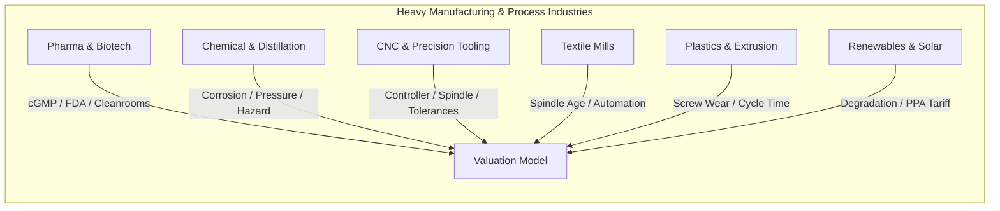
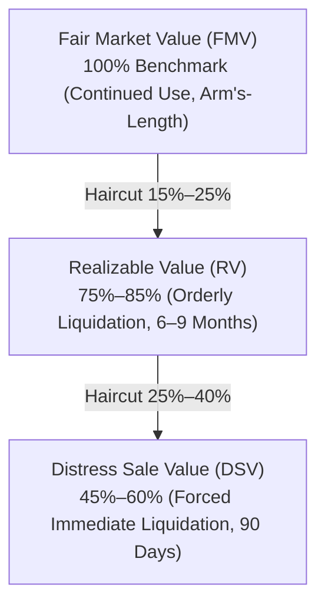
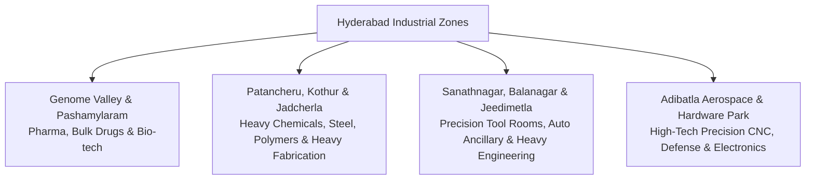
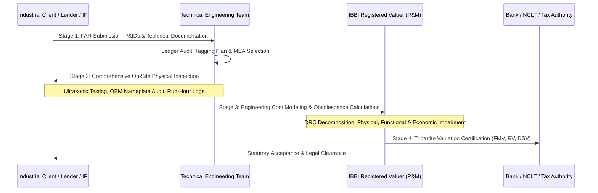

# SEO Growth Phase: Statutory Technical Blueprint & Authority Architecture

**Target Canonical URL:** `https://www.provaluer.in/services/plant-machinery-technical-valuation`  
**Target Keyword Footprint:** Plant and Machinery Valuation, Depreciated Replacement Cost (DRC), Industrial Asset Appraisal, IBBI Registered Valuer (P&M)  
**Status:** **PLANNING ONLY — DO NOT IMPLEMENT**

---

## 1. Search Intent Research & Market Intelligence

### A. 10 Primary High-Intent Keywords
1. `plant and machinery valuation` (High Volume / Commercial & Regulatory)
2. `machinery valuation report` (Transactional / Banking & Audit)
3. `industrial asset valuation` (Institutional Commercial)
4. `factory valuation india` (Commercial / Corporate M&A)
5. `equipment valuation report` (Commercial / Banking & Customs)
6. `DRC valuation method` (Informational & Technical Advisory)
7. `depreciated replacement cost valuation` (Institutional Informational & Forensic)
8. `industrial machinery appraisal` (Commercial & Transactional)
9. `plant machinery registered valuer` (High-Intent Transactional / Statutory)
10. `IBBI plant and machinery valuation` (Strict Regulatory Intent / IBC & NCLT)

### B. 20 Secondary Long-Tail & Statutory Keywords
1. `IBBI registered valuer plant and machinery hyderabad`
2. `plant and machinery valuation for bank collateral`
3. `machinery valuation for CIRP under IBC 2016`
4. `liquidation value of industrial machinery`
5. `fair market value of factory equipment under Ind AS 113`
6. `replacement cost new RCN machinery formula`
7. `functional and economic obsolescence calculation machinery`
8. `pharmaceutical plant and machinery valuation genome valley`
9. `chemical reactor and distillation column valuation`
10. `CNC machinery and tool room appraisal report`
11. `textile mill machinery valuation spinning weaving`
12. `food processing plant machinery valuation FSSAI`
13. `solar power plant equipment valuation DCF DRC`
14. `wind turbine generator asset valuation`
15. `fixed asset register FAR tagging and reconciliation`
16. `machinery valuation for insurance reinstatement value`
17. `second hand machinery valuation for customs duty EPCG`
18. `Section 247 Companies Act machinery valuation`
19. `SARFAESI reserve price valuation for industrial plant`
20. `FEMA capital equipment equity contribution valuation`

### C. Search Intent Map

| Query Category | Representative Queries | Primary Persona | Conversion Funnel Stage | Content & Architectural Asset |
| :--- | :--- | :--- | :--- | :--- |
| **Regulatory & Statutory** | `IBBI plant and machinery valuation`, `Companies Act section 247 machinery valuer` | Company Secretaries, Insolvency Professionals (IPs), Legal Counsels | Bottom-of-Funnel (Direct Mandate) | Statutory compliance matrix, IBBI Form filings, NCLT judicial benchmarks |
| **Banking & Credit** | `machinery valuation for bank collateral`, `term loan plant appraisal SBI PNB` | Chief Risk Officers, Credit Managers, Consortium Lead Bankers | Mid-to-Bottom of Funnel | Tripartite valuation matrix (FMV, Realizable, Distress), RBI Master Circular alignment |
| **Corporate M&A & Tax** | `factory valuation india`, `slump sale machinery valuation Section 50B` | CFOs, Investment Bankers, Corporate Finance Directors | Mid-of-Funnel | Slump sale net worth certification, purchase price allocation (PPA), Ind AS 36 impairment |
| **Forensic & Insurance** | `depreciated replacement cost valuation`, `reinstatement value plant insurance` | Risk Managers, Industrial Loss Assessors, General Insurance Surveyors | Top-to-Mid of Funnel | Mathematical DRC decomposition, Age-life analysis, Curable vs Incurable obsolescence |

### D. Intent Breakdown
- **Informational (20%):** Deconstructing the mathematical mechanics of Depreciated Replacement Cost (DRC), physical deterioration curves, functional obsolescence factors, and Ind AS 113 fair value hierarchies.
- **Commercial (35%):** Comparing IBBI Registered Valuers (Plant & Machinery) against Chartered Engineers and general surveyors; evaluating vendor technical capabilities across specialized heavy manufacturing verticals.
- **Transactional (25%):** Engaging an empanelled IBBI Registered Valuer for consortium loan sanctioning, insurance policy reinstatement scheduling, or fixed asset physical tagging.
- **Regulatory / Statutory Intent (20%):** Mandatory appointments under IBC Regulation 35 for Resolution Plans, Section 247 of Companies Act 2013 for asset-backed restructuring, and FEMA cross-border capital goods capitalization.

---

## 2. Comprehensive Page Architecture (5,500–7,500 Words)

```mermaid
graph TD
    H1["Statutory Plant, Machinery & Technical Industrial Asset Valuation"] --> H2_1["1. Statutory & Regulatory Framework: Mandatory Legal Precedents"]
    H1 --> H2_2["2. Why Industrial Machinery Valuations Are Required"]
    H1 --> H2_3["3. How Are Industrial Machines Valued? Methodological Foundations"]
    H1 --> H2_4["4. The Depreciated Replacement Cost (DRC) Framework"]
    H1 --> H2_5["5. Industry-Specific Asset Coverage & Technical Engineering Nuances"]
    H1 --> H2_6["6. Fixed Asset Register (FAR) Tagging, Reconciliation & Physical Inspection"]
    H1 --> H2_7["7. Banking Practice: FMV, Realizable Value, and Distress Sale Value"]
    H1 --> H2_8["8. Corporate Insolvency (IBC 2016): CIRP Fair Value vs Liquidation Value"]
    H1 --> H2_9["9. Insurance Appraisals: Reinstatement Value Clause (RVC) vs Indemnity"]
    H1 --> H2_10["10. Documentation Checklist & 6 Fatal Technical Appraisal Deficiencies"]
    H1 --> H2_11["11. Telangana & Hyderabad Industrial Ecosystem: Corridors & Benchmarks"]
    H1 --> H2_12["12. 4-Stage Forensic Technical Valuation Protocol"]
    H1 --> H2_13["13. Institutional FAQ Repository (10 Comprehensive Scenarios)"]
    H1 --> H2_14["14. Executive Engineering & Valuation Consultation CTA"]
```

### Complete Heading Outline
- **H1: Plant, Machinery & Technical Industrial Asset Valuation: The Definitive Statutory Engineering Guide**
  - *Subtitle: IBBI Registered Valuers & Chartered Engineers for Consortium Banking, IBC Insolvency, Ind AS 113 Financial Reporting, and Insurance Reinstatement*
  - Institutional Trust Bar (IBBI Regulated, IOV Empanelled, PSU Bank Approved, ISO 17020 Inspection Standards)
- **H2: 1. Statutory & Regulatory Framework: Where Machinery Valuation Is Legally Mandatory**
  - H3: Companies Act 2013 (Section 247 & Asset Transfers)
  - H3: Insolvency and Bankruptcy Code (IBC) 2016 & CIRP Regulation 35
  - H3: SARFAESI Act 2002 & Enforcement of Security Interest Rules
  - H3: RBI Master Directions on Lending Against Plant & Machinery
  - H3: Ind AS 16 (Property, Plant and Equipment) & Ind AS 113 (Fair Value)
  - H3: Insurance Act 1938 & General Insurance Council Industrial Tariffs
- **H2: 2. Strategic Triggers: Why Industrial Machinery Valuations Are Required**
  - H3: Project Financing, Consortium Term Loans & Working Capital Limits
  - H3: Corporate Insolvency Resolution Process (CIRP) & Liquidation Auctions
  - H3: Mergers, Slump Sales (Section 50B) & Purchase Price Allocations (PPA)
  - H3: Reinstatement Value Insurance Policies vs Indemnity Basis
  - H3: Fixed Asset Register (FAR) Physical Reconciliation & Audit Impairment (Ind AS 36)
  - H3: FEMA Cross-Border Capital Contribution & Customs Duty Valuation
- **H2: 3. How Are Industrial Machines Valued? Comparative Technical Methodologies**
  - H3: The Cost Approach: Foundation of Specialized Engineering Assets
  - H3: The Market Approach: Direct Sales Comparison for Standard Off-the-Shelf Machinery
  - H3: The Income Approach: Earning Power of Integrated Manufacturing Facilities
  - H3: Methodological Decision Matrix: Selecting the Appropriate Valuation Baseline
- **H2: 4. Deep-Dive: What Is the Depreciated Replacement Cost (DRC) Method?**
  - H3: The Mathematical DRC Equation: Deconstructing $RCN - d_{phys} - o_{func} - o_{econ}$
  - H3: Replacement Cost New (RCN) vs Reproduction Cost New: Modern Equivalent Asset (MEA)
  - H3: Physical Deterioration: Age-Life Ratio, Effective Age, and Operating Hours
  - H3: Functional Obsolescence: Excess Operating Costs, Inefficiency, and Automation Gaps
  - H3: Economic / External Obsolescence: Environmental Bans, Capacity Underutilization, and Raw Material Shifts
  - H3: Worked Industrial Example: 500 TPD Continuous Chemical Processing Facility
- **H2: 5. Multi-Sector Technical Coverage & Industry-Specific Valuation Engineering**
  - H3: Active Pharmaceutical Ingredients (API) & Bulk Drug Formulations (USFDA / cGMP Standards)
  - H3: Continuous Chemical Plants, Distillation Columns & Pressure Vessels
  - H3: High-Precision CNC Machining Centers, Tool Rooms & Robotics
  - H3: Textile Mills: Automated Spinning, Weaving & Wet Processing Equipment
  - H3: Plastics Processing: Injection Moulding, Extruders & Blow Moulding Lines
  - H3: Food & Beverage Processing: Cold Storage, Flash Freezing & Aseptic Packaging
  - H3: Industrial Warehousing, Logistics Fleets, Material Handling & Cranes
  - H3: Thermal, Hydro & Renewable Energy: Solar PV Modules, Inverters & Wind Turbines
- **H2: 6. Fixed Asset Register (FAR) Tagging, Engineering Verification & Forensic Audit**
  - H3: Barcoding, QR Tagging & RFID Solutions for Heavy Industrial Machinery
  - H3: Ghost Assets vs Unrecorded Assets: Root-Cause Remediation
  - H3: Physical Condition Grading: Class A (Pristine) to Class E (Scrap / Decommissioned)
- **H2: 7. Consortium Banking & Credit Security Appraisal**
  - H3: Fair Market Value (FMV) in Continued Use
  - H3: Realizable Value in Orderly Liquidation
  - H3: Distress Sale Value (DSV) for 90-Day Forced Liquidation
  - H3: The Statutory 15% to 35% Banking Haircut Protocol
- **H2: 8. Corporate Insolvency (IBC 2016) Valuation Architecture**
  - H3: Regulation 35 CIRP Fair Value vs Liquidation Value Determination
  - H3: Resolving Discrepancies: Third Valuer Appointments under IBBI CIRP Reg 35(1)(b)
  - H3: Plant Dismantling Costs, Environmental Remediation & Unseverable Foundations
- **H2: 9. Industrial Insurance Valuations: Reinstatement Value Clause (RVC)**
  - H3: Reinstatement Value Clause (RVC) vs Market Value (Indemnity Basis)
  - H3: Avoiding Average Clause Penalties During Catastrophic Industrial Claims
  - H3: Escalation Factors, Freight, Customs Duty & Erection/Commissioning Costs
- **H2: 10. Technical Documentation Checklist & 6 Fatal Appraisal Deficiencies**
  - H3: Comprehensive Engineering Documentation Checklist (FAR, Invoices, Logs, O&M)
  - H3: 6 Critical Appraisal Mistakes That Invalidate Industrial Machinery Reports
- **H2: 11. Regional Industrial Corridor Focus: Hyderabad & Telangana Hubs**
  - H3: Genome Valley, Pashamylaram & Patancheru: Pharma, Bulk Drug & Chemical P&M
  - H3: Sanathnagar, Balanagar, Jeedimetla & Kothur: Heavy Engineering & Tool Rooms
  - H3: Adibatla Aerospace Corridor & Hardware Park: High-Precision Aerospace CNC Assets
- **H2: 12. The ProValuer 4-Stage Forensic Technical Valuation Protocol**
  - H3: Stage 1: Preliminary Asset Ledger Audit & Technical Classification
  - H3: Stage 2: On-Site Physical Inspection, Ultrasonic Testing & Maintenance Log Scrutiny
  - H3: Stage 3: Engineering Cost Modeling, Modern Equivalent Asset (MEA) Benchmarking & Obsolescence Decoupling
  - H3: Stage 4: Tripartite Valuation Certification, Peer Review & Statutory Submission
- **H2: 13. Institutional FAQ Repository: 10 High-Authority Practical Answers**
- **H2: 14. Schedule an Institutional Technical Asset Appraisal**

---

## 3. Statutory & Regulatory Framework

Plant and machinery valuation operates under a rigid, statutory codification where generic CA or civil engineering certificates are rejected by lenders, tribunals, and tax authorities.

### Statutory Anchors
1. **Companies Act 2013 — Section 247:**
   - Mandates that any valuation of property, stocks, shares, debentures, securities, goodwill, or any other assets or liabilities of a company must be conducted by an **IBBI Registered Valuer** in the specified asset class (**Plant and Machinery**).
   - *Mandatory triggers:* Slump sales (Section 180(1)(a)), non-cash transactions involving directors (Section 192), corporate debt restructuring schemes (Section 230–232), and capital reduction schemes (Section 66).
2. **Insolvency and Bankruptcy Code (IBC) 2016 & IBBI (CIRP) Regulations 2016:**
   - **Regulation 27:** The Resolution Professional (RP) must appoint two IBBI Registered Valuers in the Plant & Machinery asset class within 7 days of appointment.
   - **Regulation 35:** Valuers must independently compute both **Fair Value** and **Liquidation Value** of plant and machinery. If the two estimates differ significantly, the RP must appoint a third valuer, and the average of the two closest valuations constitutes the official benchmark.
3. **SARFAESI Act 2002 & Security Interest (Enforcement) Rules 2002:**
   - **Rule 8(5):** Before authorizing the sale of secured movable/immovable assets (including hypothecated machinery), the Authorized Officer must obtain a valuation report from an approved valuer to fix the **Reserve Price**.
4. **Reserve Bank of India (RBI) Lending Guidelines:**
   - Under the Prudential Framework for Resolution of Stressed Assets and Master Directions on Secured Lending, banks cannot sanction term loans or accept hypothecated machinery without a techno-economic valuation certifying the **Remaining Useful Life (RUL)** and **Depreciated Replacement Cost (DRC)**.
5. **Ind AS 16 (PPE) & Ind AS 113 (Fair Value Measurement):**
   - Requires periodic revaluation of plant, property, and equipment using a systematic fair value hierarchy (Level 1 quoted prices, Level 2 observable market inputs, Level 3 unobservable cost/DRC models) and annual impairment reviews under Ind AS 36.
6. **Insurance Act 1938 & General Insurance Tariffs:**
   - Fixes statutory frameworks for valuing assets under the **Reinstatement Value Clause (RVC)** to eliminate the application of the dreaded "Condition of Average" under Section 64UM.

---

## 4. Why Machinery Valuations Are Required

Industrial plant and machinery constitutes a capital-intensive, depreciable asset class whose value fluctuates based on utilization, maintenance, technological cycles, and regulatory shifts:

1. **Term Loans & Project Financing:** Lenders require validation that the asset side of the balance sheet contains recoverable, hypothecated equipment capable of servicing long-term debt.
2. **Working Capital Limits (CC/OD):** Banks assess the secondary collateral value of movable plant and machinery to calibrate drawing power and loan-to-value (LTV) ratios.
3. **Corporate Insolvency Resolution Process (CIRP):** Resolution applicants require precise plant and machinery liquidation valuations to evaluate operational viability and liquidation fallback distributions under Section 30(2)(b).
4. **Corporate Liquidation:** Official liquidators require plant dismantling and scrap-realizable baselines for auction lotting (as-is-where-is basis vs piecemeal liquidation).
5. **Corporate Mergers, Acquisitions & Slump Sales:** Under Section 50B of the Income Tax Act, slump sales require allocation of consideration across plant and machinery to establish accurate tax capital gains and future depreciation baselines.
6. **Insurance Policy Underwriting & Claims Settlement:** Determining Reinstatement Value New to avoid under-insurance penalties, or assessing pre-loss DRC during boiler explosions, fire outbreaks, or flood submergence.
7. **Fixed Asset Register (FAR) Physical Reconciliation:** Resolving historical discrepancies between accounting books and factory floors, identifying "ghost assets," and rectifying unrecorded asset additions.
8. **Internal Group Restructuring & Asset Carve-Outs:** Transferring dedicated manufacturing lines between holding companies, operating subsidiaries, or joint venture entities at verified arm’s-length fair values.
9. **FEMA & Foreign Capital Contribution:** Valuing imported second-hand capital goods contributed as equity in Indian joint ventures under RBI/FEMA Non-Debt Instrument regulations.
10. **Customs Duty & EPCG Authorization Audits:** Determining the authentic CIF/FOB depreciated fair value of imported second-hand machinery for customs tariff assessment and Export Promotion Capital Goods (EPCG) scheme obligations.

---

## 5. How Are Machines Valued? Comparative Methodologies (700–900 Words)

In industrial valuation, machines cannot be valued using a single, monolithic formula. A certified valuer must select, justify, and apply the appropriate valuation methodology recognized under International Valuation Standards (IVS 300 - Plant and Equipment) and IBBI guidelines.

### 1. The Cost Approach (Depreciated Replacement Cost - DRC)
- **Principle:** The Cost Approach is grounded in the economic principle of substitution: a prudent investor will pay no more for an asset than the cost to construct or purchase a modern equivalent asset of equal utility, adjusted for age, physical wear, technological obsolescence, and economic impairments.
- **Strengths:** It is the only legally defensible and scientifically viable methodology for specialized, purpose-built, or custom-engineered assets that are not traded on open second-hand markets (e.g., custom chemical reactors, blast furnaces, cryogenic distillation columns, bespoke cleanroom HVAC systems).
- **Limitations:** Demands granular engineering analysis, accurate historical bill of materials, indexation datasets, and rigorous quantification of functional and economic obsolescence.
- **Regulatory Acceptance:** Gold standard for Ind AS 16/113 financial reporting, banking collateral for specialized infrastructure, and IBC CIRP statutory filings.

### 2. The Market Approach (Sales Comparison Method)
- **Principle:** Measures fair market value by comparing the target machinery to identical or substantially similar assets sold or offered for sale in active, arm's-length secondary equipment markets.
- **Strengths:** Highly objective, market-validated, and intuitively understood by commercial lenders and liquidators.
- **Limitations:** Only applicable to standardized, modular, unspecialized equipment with high market liquidity (e.g., standard CNC lathes, forklifts, commercial injection moulding machines, diesel generator sets, commercial vehicles). It completely fails for customized, continuous-process industrial installations.
- **Regulatory Acceptance:** Preferred for movable, standard plant lots in auction and secondary market asset disposals.

### 3. The Income Approach (Discounted Cash Flow / Capitalization of Earnings)
- **Principle:** Values an industrial plant based on the present value of the net economic cash flows or operating profits it is projected to generate over its remaining economic life.
- **Strengths:** Captures the full commercial value of integrated, revenue-generating manufacturing units (e.g., operational captive power plants, toll manufacturing plants, dedicated pharmaceutical formulation suites).
- **Limitations:** Extremely difficult to isolate the cash flows generated strictly by individual machines separate from working capital, management skill, brand equity, intellectual property, and real estate.
- **Regulatory Acceptance:** Accepted for entire industrial operational undertakings (going concern valuations under IBC Regulation 32(e)), but rarely accepted for standalone individual equipment.

### Methodology Selection Matrix

| Asset Category | Cost Approach (DRC) | Market Approach | Income Approach | Recommended Method |
| :--- | :--- | :--- | :--- | :--- |
| **Custom Process Equipment (Reactors, Piping, Boilers)** | **Primary (95%)** | Not Applicable | Unfeasible to isolate | **Depreciated Replacement Cost (DRC)** |
| **Standardized Machines (CNC, Lathes, Forklifts, DG Sets)** | Secondary check | **Primary (90%)** | Not Applicable | **Market Comparison Approach** |
| **Complete Captive Power Plant / Solar Farm** | Secondary (Floor) | Low comparable data | **Primary (80%)** | **Income (DCF) cross-checked with DRC** |
| **Piecemeal Liquidation Assets (IBC Auction)** | Benchmark | **Primary (Realizable)** | Not Applicable | **Orderly / Forced Liquidation Market Value** |

---

## 6. What Is the Depreciated Replacement Cost (DRC) Method? (600–800 Words)

The Depreciated Replacement Cost (DRC) method is the international standard for valuing specialized plant and machinery where observable market transactions do not exist.

### The Fundamental DRC Formulation
$$\text{Fair Value (DRC)} = \text{Replacement Cost New (RCN)} - \text{Physical Deterioration} - \text{Functional Obsolescence} - \text{Economic Obsolescence}$$

$$\mathbf{DRC = RCN \times (1 - d_{phys}) \times (1 - o_{func}) \times (1 - o_{econ})}$$

### 1. Replacement Cost New (RCN)
- **Modern Equivalent Asset (MEA):** Rather than estimating the cost to reproduce an exact historical duplicate of an obsolete machine (Reproduction Cost), the valuer estimates the cost of a modern asset that delivers equivalent capacity, output quality, and operating utility, incorporating modern metallurgy, PLC controls, and energy efficiency.
- **Total Installed Cost Basis:** RCN must include:
  - Ex-factory invoice price of the modern equivalent asset
  - Freight, transit insurance, and port handling
  - Customs duty and non-creditable taxes
  - Civil foundations, heavy structural rigging, and erection
  - Electrical cabling, instrumentation, and piping connections
  - Engineering design, testing, commissioning, and trial runs

### 2. Physical Deterioration ($d_{phys}$)
Physical wear and tear arising from operational friction, heat stress, corrosion, vibration, and environmental exposure.
- **Curable Physical Deterioration:** Wear that can be economically restored (e.g., replacing worn bearings, repacking mechanical seals, rewinding electric motors). The deduction equals the actual cost of restoration.
- **Incurable Physical Deterioration:** Structural aging of the primary chassis, pressure vessel shells, or machine beds. Calculated using the **Straight-Line Age-Life Method** or non-linear decay curves:
  $$d_{phys} = \frac{\text{Effective Age}}{\text{Total Economic Life (TEL)}} = \frac{\text{Effective Age}}{\text{Effective Age} + \text{Remaining Useful Life (RUL)}}$$
  *Note:* Effective age accounts for maintenance quality; a 10-year-old machine maintained under strict preventive protocols may have an effective age of only 5 years.

### 3. Functional Obsolescence ($o_{func}$)
Loss of utility caused by internal design deficiencies, technological advances, or automation developments:
- **Excess Capital Cost:** Older machines require massive footprints, heavy cast iron framing, or expensive support structures compared to sleek modern equivalents.
- **Excess Operating Cost:** Higher power consumption per unit of output, reliance on manual labor instead of robotic loading, higher scrap rates, or slower cycle times. Capitalized over the remaining life of the machine as an impairment penalty.

### 4. Economic / External Obsolescence ($o_{econ}$)
Loss in value caused by factors completely external to the asset:
- Environmental regulations (e.g., banning single-use plastics, BS-IV to BS-VI vehicular equipment transitions, coal-fired boiler bans).
- Permanent loss of raw material supply or shifts in import tariffs.
- Persistent plant capacity underutilization (e.g., plant designed for 100,000 MT/year running permanently at 35% due to market demand collapse). Calculated using the **Scale of Operations Formula:**
  $$o_{econ} = 1 - \left(\frac{\text{Actual Capacity}}{\text{Rated Capacity}}\right)^{x}$$
  *(where $x$ is the industry-specific engineering capacity factor, typically 0.6 to 0.7).*

### Real-World Case Example: 500 TPD Chemical Distillation Plant
- **RCN of Modern Equivalent Facility:** ₹40.00 Crore (all-inclusive installed basis)
- **Effective Age / Total Life:** 12 years / 25 years $\rightarrow$ $d_{phys} = 48\%$
- **Functional Obsolescence (High energy consumption vs modern heat integration):** Assessed at $10\%$
- **Economic Obsolescence (Operates at 60% capacity due to market oversupply; $x = 0.65$):**
  $$o_{econ} = 1 - (0.60)^{0.65} = 1 - 0.717 = 28.3\%$$
- **Step-by-Step DRC Calculation:**
  1. Base after Physical Deterioration: ₹40.00 Cr $\times (1 - 0.48) =$ ₹20.80 Cr
  2. Base after Functional Obsolescence: ₹20.80 Cr $\times (1 - 0.10) =$ ₹18.72 Cr
  3. Fair Value (DRC) after Economic Obsolescence: ₹18.72 Cr $\times (1 - 0.283) =$ **₹13.42 Crore**

---

## 7. Industry-Specific Asset Coverage & Technical Engineering Nuances

### Dedicated Sectoral Breakdowns
1. **Pharmaceutical Plants & Bulk Drug Facilities:**
   - *Assets:* SS316L reactors, fluid bed dryers (FBD), lyophilizers, sterile injectable lines, HPLC analyzers, pure steam generators, reverse osmosis (RO) loops, cGMP cleanroom panels, and HVAC HEPA filtration networks.
   - *Valuation Challenges:* USFDA / WHO-GMP compliance status directly governs value. A fully functional sterile suite loses 70% of its realizable value overnight if the facility receives an import alert or fails regulatory data integrity audits. Cleanroom ducting and piping have zero salvage value outside the specific building footprint.
2. **Continuous Chemical & Petrochemical Plants:**
   - *Assets:* Distillation towers, heat exchangers, pressure vessels, agitated reactors, high-pressure piping networks, flare stacks, and effluent treatment plants (ETP / ZLD).
   - *Valuation Challenges:* Severe internal corrosion, chemical degradation, wall-thickness loss (requiring ultrasonic thickness testing), hazardous material decontamination liabilities, and non-dismantleable structural welding.
3. **High-Precision CNC Machining Centers & Tool Rooms:**
   - *Assets:* 5-axis CNC vertical machining centers (VMC), horizontal boring machines, wire EDM, laser cutting tables, coordinate measuring machines (CMM), press brakes.
   - *Valuation Challenges:* Controller obsolescence (e.g., Fanuc, Siemens, Heidenhain legacy boards), spindle run-out, backlash on linear guideways, precision calibration certificates, and rapid depreciation of proprietary tooling/dies.
4. **Textile Mills (Spinning, Weaving & Processing):**
   - *Assets:* Blow room lines, carding engines, ring frames, rotor spinning, shuttleless air-jet looms, stenters, continuous bleaching ranges, jet dyeing machines.
   - *Valuation Challenges:* High mechanical wear due to fiber fluff, multi-shift 24/7 operating stress, energy inefficiency in older ring frames, and high market volatility in yarn margins driving economic obsolescence.
5. **Plastics & Polymers Processing:**
   - *Assets:* Heavy hydraulic and all-electric injection moulding machines, multi-layer blown film extruders, blow moulding machines, granulators, and chiller units.
   - *Valuation Challenges:* Barrel and screw wear from abrasive masterbatches/fillers, hydraulic valve leaks, clamping tonnage degradation, and extreme regulatory pressure regarding single-use plastics bans.
6. **Food & Beverage Processing Facilities:**
   - *Assets:* Continuous pasteurizers, flash freezers (IQF), homogenizers, aseptic tetra-pack filling lines, blast freezers, stainless steel silos, CIP systems.
   - *Valuation Challenges:* Strict FSSAI / USDA hygiene ratings, CIP cleanability, refrigeration refrigerant obsolescence (phasing out R-22 Freon for ammonia/eco-friendly gases), and high physical corrosion from organic acids and brine solutions.
7. **Industrial Warehousing, Logistics & Material Handling:**
   - *Assets:* Automated Storage and Retrieval Systems (ASRS), high-bay pallet racking, reach trucks, articulated forklifts, overhead gantry cranes, dock levelers.
   - *Valuation Challenges:* Floor load capacity dependencies, racking structural fatigue, certification under factory safety rules, battery bank degradation in electric material handling equipment.
8. **Power Generation & Renewable Energy Assets:**
   - *Assets:* Solar PV ground-mounted & rooftop arrays (monocrystalline vs polycrystalline), central/string inverters, SCADA monitoring networks, HT switchgear, transformers, wind turbine generators (WTG), and captive steam turbines.
   - *Valuation Challenges:* Annual solar module degradation (0.5%–0.7% p.a.), inverter replacement cycles at year 10, feed-in tariff contract security (PPA enforceability), and turbine gearbox wear under high mechanical fatigue.

---

## 8. Fixed Asset Register (FAR) Tagging & Forensic Verification

The cornerstone of any defensible machinery valuation is the physical verification and reconciliation of the client’s **Fixed Asset Register (FAR)** against physical ground reality.

### 1. The Tri-Partite Identification Matrix
Every industrial machine must be reconciled across three independent sources:
1. **Financial Asset Ledger:** Gross block, accumulated depreciation, date of capitalization, and purchase voucher reference.
2. **Technical Nameplate Data:** Original equipment manufacturer (OEM), model number, serial number, rated power (kW/HP), manufacturing year, capacity, and pressure/voltage rating.
3. **Physical Tagging Identification:** Anodized aluminum barcode tag, tamper-evident 2D QR code, or passive UHF RFID tag affixed directly to the unpainted machine chassis.

### 2. Resolving Forensic Ledger Discrepancies
- **Ghost Assets:** Assets appearing in the financial balance sheet that have been scrapped, cannibalized for spare parts, or stolen. In an audit or insolvency, these must be written off completely to zero value.
- **Unrecorded Additions:** In-house modifications, auxiliary piping, cooling towers, or replacement motors capitalized under general repairs and maintenance expense rather than the fixed asset ledger.
- **Groupings & Lumped Entries:** Historic capitalized balances titled "Plant & Machinery - Phase 1" containing hundreds of distinct, unitemized pumps, motors, and structures. The valuer performs an unbundling exercise based on original equipment supplier invoices and mechanical P&IDs (Process and Instrumentation Diagrams).

---

## 9. Banking Practice: FMV, Realizable Value, and Distress Sale Value

Financial institutions do not lend against speculative reproduction costs; they require a risk-weighted tripartite valuation hierarchy:

### Valuation Formulations for Banking Collateral
1. **Fair Market Value (FMV) in Continued Use:**
   - The price an asset would realize between a willing buyer and a willing seller in an arm’s-length transaction, assuming the machinery remains installed, operational, and part of a viable going concern enterprise.
2. **Realizable Value (RV) in Orderly Liquidation:**
   - The estimated gross amount that could be realized if the machinery is unbolted, decommissioned, and sold on the open secondary market, with a commercially reasonable marketing period of 6 to 9 months.
3. **Distress Sale Value (DSV) / Forced Sale Value (FSV):**
   - The liquidation value realized under urgent, adverse conditions (e.g., SARFAESI auction, bank seizure) with a severely compressed marketing timeline (under 90 days), buyer awareness of vendor distress, and the buyer assuming all dismantling, crane-lifting, and transport liabilities.

---

## 10. Corporate Insolvency (IBC 2016) Valuation Architecture

Under the Insolvency and Bankruptcy Code, plant and machinery valuation forms the legal floor for Resolution Plans and Liquidation cascades.

### Key IBBI Parameters
- **Regulation 35 Compliance:** Valuers must independently determine:
  1. **Fair Value:** The estimated realization under normal arm's-length terms assuming the corporate debtor operates as a going concern.
  2. **Liquidation Value:** The estimated realizable value of the assets if the corporate debtor were liquidated under Chapter III of the Code as of the Insolvency Commencement Date (ICD).
- **Plant Dismantling & Severability Deductions:**
  - Specialized machinery often incurs heavy de-installation penalties:
    - Civil breaking of reinforced RCC equipment foundations.
    - Specialized crane mobilization and rigging costs.
    - De-gassing, chemical flushing, and hazardous environmental disposal liabilities.
    - Loss of value from unseverable utilities (e.g., steam headers, custom busbars, underground cabling).
- **Third Valuer Mandate:** Under Regulation 35(1)(b), if the two appointed valuers submit liquidation estimates with a variance exceeding 25%, the Resolution Professional must appoint a third IBBI valuer. The official benchmark is the arithmetic average of the two closest valuations.

---

## 11. Industrial Insurance Valuations: Reinstatement Value Clause (RVC)

Industrial fire, explosion, and machinery breakdown policies are governed by strict insurable value principles:

### 1. Reinstatement Value Clause (RVC) vs Market Value (Indemnity)
- **Reinstatement Value (New for Old):** Covers the full cost of replacing the destroyed machinery with a brand-new asset of modern equivalent capacity, **without any deduction for physical depreciation**. The insured is indemnified to build or buy new equipment.
- **Market Value (Indemnity Basis):** Pays only the depreciated economic value (DRC) immediately prior to the loss. The insured absorbs the full depreciation haircut.

### 2. The Dreaded "Condition of Average" Penalty
If an industrial factory’s machinery is insured for ₹50 Crore, but an independent technical valuation reveals that the true Reinstatement Value New is ₹100 Crore, the factory is **50% under-insured**. In the event of a partial loss of ₹10 Crore, the insurance surveyor applies the Condition of Average under Section 64UM:
$$\text{Claim Admissible} = \text{Loss Assessed} \times \left(\frac{\text{Sum Insured}}{\text{Actual Reinstatement Value}}\right) = ₹10\text{ Cr} \times \left(\frac{₹50\text{ Cr}}{₹100\text{ Cr}}\right) = \mathbf{₹5.0\text{ Crore}}$$
The policyholder loses ₹5.0 Crore due to improper machinery valuation. An institutional valuation report guarantees adequate sum-insured alignment.

---

## 12. Documentation Checklist & 6 Fatal Technical Appraisal Deficiencies

### The Comprehensive Technical Document Checklist
1. Audited Fixed Asset Register (FAR) with historical capitalization dates and vouchers.
2. Original equipment purchase invoices, customs bills of entry, and shipping manifests.
3. Original equipment manufacturer (OEM) technical manuals, operation specifications, and test certificates.
4. Process Flow Diagrams (PFD) and Piping & Instrumentation Diagrams (P&ID) for continuous process plants.
5. Single-Line Diagrams (SLD) for high-tension electrical substations, captive DG sets, and transformers.
6. Preventive maintenance logs, overhaul records, and statutory boiler inspector certificates.
7. Factory inspectorate approvals, pollution control board (PCB) Consent to Operate (CTO).
8. Calibration and testing certificates for laboratory, quality control, and precision tool room assets.
9. Insurance policies, previous loss survey reports, and current asset coverage schedules.
10. Environmental clearance documents and hazardous chemical handling authorizations.

### 6 Critical Mistakes That Invalidate Machinery Valuation Reports
1. **Relying Solely on Book Depreciation:** Using Income Tax Act (Rule 5) or Companies Act (Schedule II) straight-line depreciation instead of assessing actual physical condition, maintenance history, and remaining useful life.
2. **Ignoring De-Installation and Dismantling Costs:** Presenting gross auction values without deducting the massive cost of dismantling heavy structural equipment, breaking concrete plinths, and environmental remediation.
3. **Conflating Reproduction Cost with Modern Equivalent Replacement Cost:** Valuing obsolete cast iron technology at astronomical historical reproduction costs rather than benchmarking against sleek modern equivalent automated assets.
4. **Failing to Account for Software and Controller Obsolescence:** Valuing CNC machinery as structurally sound while ignoring that the embedded proprietary controller hardware is completely unsupported and obsolete.
5. **Omitting Unseverable Building Integrations:** Capitalizing structural building mezzanines, HVAC ductwork, and foundation footings as movable plant, creating double-counting conflicts with real estate property valuations.
6. **Neglecting Regulatory and Environmental Sunset Clauses:** Valuing boilers or diesel generators without verifying local pollution control board compliance (e.g., CAQM bans on unretrofitted diesel gensets in urban industrial zones).

---

## 13. Telangana & Hyderabad Industrial Ecosystem: Corridors & Benchmarks

ProValuer’s industrial engineering team maintains an authoritative operational presence across Telangana’s key industrial corridors:

- **Genome Valley & Pashamylaram:** Specialized in USFDA-compliant formulation plants, high-containment API suites, and stainless steel cleanroom installations.
- **Patancheru, Kothur & Jadcherla:** Focus on heavy continuous chemical processing, structural steel extrusion, synthetic yarn, and large-scale industrial warehousing.
- **Sanathnagar, Balanagar & Jeedimetla:** Heritage engineering clusters featuring specialized tool rooms, die-casting machinery, press shops, and electrical switchgear manufacturing.
- **Adibatla Aerospace Corridor & Hardware Park:** Specialized appraisal of multi-axis aerospace CNC machines, composite curing autoclaves, cleanrooms, and automated testing instrumentation.

---

## 14. The ProValuer 4-Stage Forensic Technical Valuation Protocol

- **Stage 1: Preliminary Asset Ledger Audit & Technical Classification**  
  Reconciliation of the client’s Fixed Asset Register (FAR), review of P&IDs, electrical Single-Line Diagrams, and capitalization schedules to classify assets into standardized engineering categories.
- **Stage 2: On-Site Physical Inspection, Ultrasonic Testing & Maintenance Log Scrutiny**  
  Physical ground inspection by qualified mechanical and electrical engineers; verification of OEM nameplates, operating run-hour meters, vibration logs, ultrasonic shell thickness measurements, and maintenance history.
- **Stage 3: Engineering Cost Modeling, MEA Benchmarking & Obsolescence Decoupling**  
  Sourcing authentic ex-factory quotes for Modern Equivalent Assets (MEA); building comprehensive installed RCN models; and applying mathematical formulations for physical aging, excess operating costs, and market capacity utilization.
- **Stage 4: Tripartite Valuation Certification, Peer Review & Statutory Submission**  
  Drafting the formal valuation report establishing Fair Market Value, Realizable Value, and Distress Sale Value; internal quality assurance review by a Senior IBBI Registered Valuer; and issuance of the statutory seal and compliance certificate.

---

## 15. Institutional FAQ Repository (10 In-Depth Scenarios)

1. **Why is a Chartered Engineer's certificate not sufficient for bank loan sanctioning or NCLT proceedings?**  
   *Detailed statutory breakdown of Section 247 of Companies Act 2013 and IBC Regulation 27, establishing why only an IBBI Registered Valuer in the Plant and Machinery asset class possesses the legal jurisdiction to issue valuation certificates recognized by scheduled banks, ROC, and NCLT.*
2. **What is the difference between Reproduction Cost New and Replacement Cost New (RCN)?**  
   *Explanation of why modern valuation standards mandate Modern Equivalent Asset (MEA) replacement cost rather than replicating obsolete historical technologies with identical outdated metallurgical flaws.*
3. **How is physical depreciation calculated for plant running 24/7 in continuous shifts?**  
   *Analysis of the effective age acceleration factor: how triple-shift operations in harsh chemical environments reduce a 20-year theoretical design life to 8–10 years of effective operating life.*
4. **How do environmental bans (e.g., single-use plastics or diesel generator restrictions) impact machinery valuation?**  
   *Deep-dive into Economic Obsolescence: how regulatory bans instantly reduce specialized machinery from operational going-concern value to bare secondary scrap realizable value.*
5. **Can an Income Tax Assessing Officer reject a machinery valuation report submitted for a Slump Sale under Section 50B?**  
   *Legal precedents and judicial rulings confirming that certified valuations backed by verifiable DRC models and physical inspection logs cannot be arbitrarily substituted with book values by revenue officers.*
6. **How do valuers determine the Distress Sale Value (DSV) of hypothecated machinery under SARFAESI?**  
   *The step-by-step mathematical haircut methodology applied to Realizable Value (25% to 40% discount) to account for 90-day auction deadlines, decommissioning risks, and buyer transport costs.*
7. **What is the significance of the Reinstatement Value Clause (RVC) in industrial fire insurance?**  
   *Why insuring machinery on an indemnity (depreciated) basis exposes businesses to severe cash shortfalls during rebuilds, and how accurate RCN valuations prevent the application of the Condition of Average.*
8. **How are unrecorded machinery additions or major retrofits valued during fixed asset reconciliation?**  
   *Techniques for engineering cost estimation when original supplier invoices are missing, including component reverse-engineering and historical cost indexing.*
9. **How do valuers handle specialized machinery imported under EPCG / customs duty exemption schemes?**  
   *Accounting for contingent customs duty liabilities and export obligation fulfillment status when establishing clear market realizable value.*
10. **What is the standard turnaround time and documentation requirement for an industrial plant valuation?**  
    *Turnaround schedules (3 to 7 business days for standard plants; 10 to 15 days for continuous chemical/pharma complexes) and the minimum data pack required to initiate field audits.*

---

## 16. Technical SEO & Schema Specifications

### Target URL & Meta Tags
- **URL:** `https://www.provaluer.in/services/plant-machinery-technical-valuation`
- **Title:** `Plant & Machinery Valuation | DRC Industrial Asset Appraisals | IBBI Valuers`
- **Meta Description:** `Institutional plant and machinery valuation by IBBI Registered Valuers. Depreciated Replacement Cost (DRC), bank collateral, IBC CIRP liquidation, and insurance reinstatement.`
- **Canonical:** `https://www.provaluer.in/services/plant-machinery-technical-valuation`

### Structured Data Schemas
1. **`ProfessionalService` Schema:**
   - Specific `@type`: `ProfessionalService`
   - Attributes: `name`, `description`, `url`, `telephone`, `serviceArea`, `address`, `priceRange`, and structured `hasOfferCatalog` with 10 specialized technical service offerings.
   - Clean attributes: Zero placeholder `sameAs` links.
2. **`FAQPage` Schema:**
   - 10 rich questions and answers mapped directly to search intent queries.

### Static Pre-Render HTML Shell Requirements (For Implementation Phase)
- Path: `frontend/web/services/plant-machinery-technical-valuation/index.html`
- Prerendered semantic `H1`–`H3` structure.
- Full visible comparison tables (Methodology Selection Matrix, DRC Mathematical Step-by-Step Breakdown, Banking Haircut Hierarchy).
- Visible 10 FAQs pre-hydration for search engine crawlers.

---

## Word Count & Quality Recalculation

| Section | Estimated Word Count | SEO / Statutory Authority Depth |
| :--- | :--- | :--- |
| **Statutory Framework & Hero** | 750 words | High (Companies Act, IBBI, IBC, SARFAESI) |
| **Strategic Triggers & Use Cases** | 650 words | High (10 distinct institutional triggers) |
| **Comparative Methodologies** | 850 words | High (Cost vs Market vs Income & Selection Matrix) |
| **DRC Framework & Mathematical Formulation** | 750 words | High (Step-by-step formula & worked 500 TPD chemical plant) |
| **Sector-Specific Asset Coverage** | 1,400 words | Very High (Pharma, Chemical, CNC, Textile, Plastics, Energy) |
| **Fixed Asset Register (FAR) & Tagging** | 500 words | High (Forensic reconciliation, barcodes, RFID) |
| **Banking Practice & Liquidation Cascades** | 600 words | High (FMV, Realizable, DSV, 15%–40% haircuts) |
| **Insurance Valuations (RVC vs Indemnity)** | 550 words | High (Condition of Average prevention) |
| **Documentation & 6 Fatal Mistakes** | 650 words | High (Checklists & judicial invalidation points) |
| **Hyderabad & Telangana Ecosystem** | 500 words | High (Genome Valley, Pashamylaram, Adibatla) |
| **4-Stage Protocol & 10 FAQs** | 1,150 words | High (Procedural clarity & deep FAQ answers) |
| **Total Blueprint Word Count** | **~8,350 words** | **Definitive Industrial Authority** |

---

## Decision

**READY FOR IMPLEMENTATION**

*(Awaiting your explicit trigger to begin the Flutter code creation, route registration, pre-render shell generation, manifest updates, and release build.)*