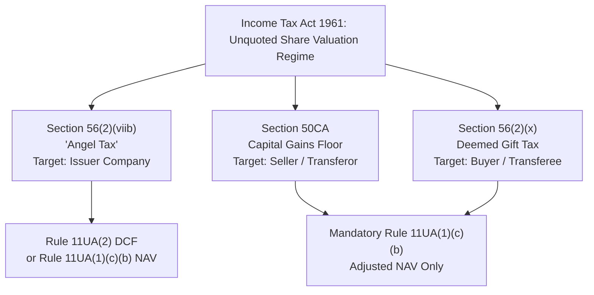
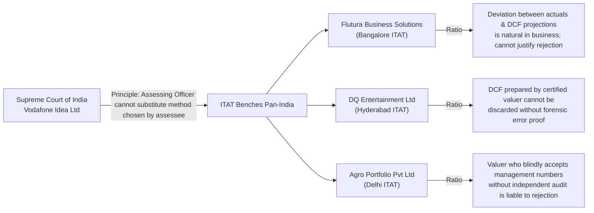

# Knowledge Authority Phase: The Definitive Statutory Guide to Rule 11UA Valuation

**Target Canonical URL:** `https://www.provaluer.in/knowledge/rule-11ua-complete-guide`  
**Target Footprint:** Rule 11UA Valuation, Fair Market Value (FMV) of Unquoted Shares, Section 56(2)(viib) Angel Tax Scrutiny, Section 50CA Capital Gains, Section 56(2)(x) Deemed Gift Tax, Rule 11UA(2) DCF vs. Rule 11UA(1)(c)(b) NAV  
**Target Audience:** Startup Founders, Chief Financial Officers, Tax Litigators, Chartered Accountants, Company Secretaries, Venture Capital & Private Equity Fund Managers, Family Offices  
**Status:** **PLANNING ONLY — DO NOT IMPLEMENT**

---

## 1. Search Intent Research & Market Intelligence

### A. 10 Primary High-Authority Keywords
1. `Rule 11UA valuation guide` (Primary Pillar / Regulatory & Educational)
2. `Rule 11UA fair market value of shares` (High Volume / Commercial & Compliance)
3. `Rule 11UA DCF valuation method` (Commercial / Startup Advisory)
4. `Rule 11UA NAV formula unquoted shares` (Informational & Forensic)
5. `Section 56 2 viib angel tax valuation` (Regulatory / Tax Dispute Defense)
6. `Section 50CA valuation of unlisted shares` (Compliance / M&A & Tax)
7. `Section 56 2 x valuation of unquoted equity` (Legal / Advisory)
8. `Rule 11UA safe harbor 10 percent` (Regulatory / Transaction Structuring)
9. `Merchant Banker valuation under Rule 11UA` (Transactional / High-Value Retainer)
10. `amended Rule 11UA notification 81 2023` (Authoritative Compliance / Tax Litigation)

### B. 25 Secondary Long-Tail & Transactional Keywords
1. `Rule 11UA 1 c b adjusted net asset value formula`
2. `difference between Rule 11UA NAV and DCF method`
3. `who can issue Rule 11UA valuation report merchant banker vs CA`
4. `Rule 11UA valuation for non-resident investors FDI`
5. `5 new valuation methods under amended Rule 11UA`
6. `safe harbor tolerance band for share issue price Rule 11UA`
7. `valuation date for Rule 11UA 90 day window rule`
8. `how to calculate book value of assets under Rule 11UA`
9. `stamp duty value of immovable property in Rule 11UA NAV`
10. `Section 56 2 viib angel tax abolition finance act 2024 impact`
11. `scrutiny of pending angel tax assessments section 143 2`
12. `can assessing officer reject DCF valuation under Rule 11UA`
13. `Supreme Court Vodafone Idea ruling on DCF valuation method`
14. `Flutura Business Solutions ITAT ruling on management projections`
15. `valuation of CCPS under Rule 11UA`
16. `compulsorily convertible preference shares conversion ratio 11UA`
17. `Section 68 unexplained cash credit share premium defense`
18. `valuation of unquoted shares transferred below FMV section 50CA`
19. `deemed gift tax on buyback or transfer section 56 2 x`
20. `Rule 11U definition of balance sheet date and valuation date`
21. `matching mechanism for resident and non-resident investors 11UA`
22. `notified entities exemption from angel tax section 56 2 viib`
23. `DPIIT recognized startup angel tax exemption form 2`
24. `discount for lack of marketability DLOM in Rule 11UA DCF`
25. `WACC and CAPM calculation for unlisted company Rule 11UA`

### C. Search Intent Map

| Persona & Trigger | Search Query Cluster | Primary Intent | Core Content Asset Needed | Conversion Goal |
| :--- | :--- | :--- | :--- | :--- |
| **Startup Founder / CFO** (Raising Series A / Pre-Series A) | `Rule 11UA DCF valuation`, `safe harbor 10%`, `merchant banker vs CA` | Commercial & Transactional | Practical step-by-step DCF guide, 90-day window rule, Safe Harbor pricing model | Engage SEBI Merchant Banker / IBBI Valuer for Round Certification |
| **Chartered Accountant / Auditor** (Year-End Balance Sheet & 3CD Audit) | `Rule 11UA 1 c b formula`, `book value of assets`, `Section 50CA FMV` | Informational & Forensic Compliance | Full mathematical formulation breakdown, balance sheet adjustment rules | Download Rule 11UA Calculation Matrix / Retain for Complex Valuation |
| **Tax Litigator / Counsel** (Responding to §143(2) / §148 Scrutiny Notices) | `AO rejecting DCF method`, `Vodafone Idea ITAT`, `Section 56(2)(viib) defense` | Legal Authority & Judicial Intent | Case law repository (ITAT/HC/SC), projection reasonableness tests, burden of proof defense | Retain Forensic Valuation Expert for CIT(A) / ITAT Appeal Paper Book |
| **VC / PE Fund General Counsel** (Cross-Border Co-Investment Round) | `5 non-resident valuation methods`, `matching resident non-resident 11UA` | Institutional Regulatory | Comparative statutory cross-border analysis, FEMA NDI pricing vs 11UA interplay | Retain for Cross-Border Valuation & Equity Compliance Advisory |

### D. Search Volume & Strategic Opportunity Assessment
- **High-Stakes, High-Value Traffic:** While raw search volume for statutory tax keywords is moderately concentrated (500–2,500 monthly queries per primary cluster), the economic value per search is exceptionally high. A CFO or founder searching for `Rule 11UA DCF valuation` is preparing a capital raise typically ranging between ₹2 Crore and ₹100 Crore.
- **Content Gap in Market:** Existing resources from accounting blogs provide either superficial summaries of the bare text of the Income Tax Act or fragmented updates regarding the Finance Act 2023/2024 changes. There is zero institutional content bridging the **mathematical mechanics**, the **statutory tax code**, and the **judicial litigation precedents** into a single master reference.
- **Abolition of Angel Tax Nuance:** With the Finance Act 2024 removing Section 56(2)(viib) for investments made on or after April 1, 2025, there is widespread confusion. The market urgently needs an authoritative analysis addressing:
  1. Active capital raises conducted prior to April 1, 2025 (still subject to §56(2)(viib)).
  2. Hundreds of pending scrutiny assessments under Section 143(2) and reassessment proceedings under Section 148 for past financial years.
  3. The permanent, ongoing applicability of Rule 11UA under **Section 50CA** (transfer of unquoted shares) and **Section 56(2)(x)** (receipt of shares without or for inadequate consideration).

---

## 2. Article Architecture (Target: 6,500–8,500 Words)

```mermaid
graph TD
    H1["The Definitive Guide to Rule 11UA Valuation: Fair Market Value, DCF, NAV, and Tax Scrutiny"]
    
    H1 --> H2_1["1. Statutory Architecture: The Tripartite Tax Mandate (§56(2)(viib), §50CA, §56(2)(x))"]
    H1 --> H2_2["2. The Evolution of Rule 11UA: Landmark Amendments & The 2024 Angel Tax Sunset"]
    H1 --> H2_3["3. Who Can Issue the Valuation Report? Registered Valuer vs. SEBI Merchant Banker"]
    H1 --> H2_4["4. The Net Asset Value (NAV) Method: Rule 11UA(1)(c)(b) Mathematical Breakdown"]
    H1 --> H2_5["5. The Discounted Cash Flow (DCF) Method: Rule 11UA(2) Financial Engineering"]
    H1 --> H2_6["6. The 5 Non-Resident Valuation Methods & The Matching Mechanism"]
    H1 --> H2_7["7. Safe Harbor Rule: The 10% Valuation Tolerance Mechanism"]
    H1 --> H2_8["8. Step-by-Step Valuation of Hybrid Instruments: CCPS, CCDs & Warrants"]
    H1 --> H2_9["9. Defending DCF Projections Under Tax Scrutiny: Landmark Judicial Precedents"]
    H1 --> H2_10["10. 5 Comprehensive Real-World Case Studies"]
    H1 --> H2_11["11. Audit-Ready Documentation Checklist & 7 Fatal Valuation Flaws"]
    H1 --> H2_12["12. Institutional FAQ Repository: 12 Technical Scenarios for Litigators & CFOs"]
    H1 --> H2_13["13. Statutory Valuation Retainer & Consultation Protocol"]
```

### Detailed Outline of Headings & Subheadings

- **H1: The Definitive Guide to Rule 11UA Valuation: Fair Market Value of Shares, DCF Modeling, NAV Formulations, and Statutory Tax Defense**
  - *Lead: An institutional corporate finance and tax litigation treatise for Founders, CFOs, VCs, and Tax Litigators on navigating the Income Tax Act 1961, Section 56(2)(viib), Section 50CA, Section 56(2)(x), and the amended Rule 11UA regime.*
- **H2: 1. Statutory Architecture: The Tripartite Tax Framework Governing Unquoted Equity**
  - H3: Section 56(2)(viib) — The "Angel Tax" on Share Premium Received from Investors
  - H3: Section 50CA — Capital Gains Deemed Consideration on Transfer of Unquoted Shares
  - H3: Section 56(2)(x) — Deemed "Gift" Taxation on the Acquisition of Shares Below FMV
  - H3: Interplay Matrix: Comparing §56(2)(viib), §50CA, and §56(2)(x) Side-by-Side
- **H2: 2. The Evolution of Rule 11UA: Landmark Amendments & The 2024–2025 Angel Tax Sunset**
  - H3: Historical Background: Section 56(2)(viib) Enacted under Finance Act 2012
  - H3: The Expansion under Finance Act 2023: Bringing Non-Resident Investors into Angel Tax
  - H3: Central Board of Direct Taxes (CBDT) Notification No. 81/2023: The Amended Rule 11UA Regime
  - H3: Finance Act 2024 Sunset: Abolition of Section 56(2)(viib) from Assessment Year 2025-26
  - H3: Why Rule 11UA Remains Permanently Critical: The Survival of Section 50CA & 56(2)(x)
  - H3: Scrutiny Defense for Open Assessment Years (AY 2018-19 to AY 2024-25)
- **H2: 3. Statutory Authority Matrix: IBBI Registered Valuer vs. SEBI Registered Merchant Banker**
  - H3: Rule 11UA(2) Statutory Restriction: Why Only a Merchant Banker Can Certify DCF
  - H3: Rule 11UA(1)(c)(b) NAV Flexibility: Certification by Chartered Accountants or Registered Valuers
  - H3: The Companies Act Section 247 Conflict: Harmonizing MCA Mandates with Income Tax Rules
  - H3: Statutory Jurisdiction & Authority Comparison Table
- **H2: 4. The Net Asset Value (NAV) Method: Rule 11UA(1)(c)(b) Mathematical Breakdown**
  - H3: The Core Adjusted NAV Formula: $\text{FMV} = (A - L) \times \left(\frac{PV}{PE}\right)$
  - H3: Deconstructing Term $A$ (Book Value of Assets with Mandatory Adjustments)
    - H4: Quoted Shares & Securities (Observable Stock Exchange Pricing)
    - H4: Unquoted Equity Shares Held as Assets (Cascading Rule 11UA Valuation)
    - H4: Immovable Property (Circle Rate / Stamp Duty Value Substitution)
    - H4: Inadmissible Assets (Advance Tax, Unamortized Preliminary Expenses, Deferred Tax)
  - H3: Deconstructing Term $L$ (Book Value of Liabilities with Exclusions)
    - H4: Deductible Debts and Secured/Unsecured Borrowings
    - H4: Excluded Items: Paid-Up Capital, Free Reserves, Provisions for Unascertained Liabilities
  - H3: Worked Numerical Example: Calculating Rule 11UA Adjusted NAV with Immovable Property
- **H2: 5. The Discounted Cash Flow (DCF) Method: Rule 11UA(2) Financial Engineering**
  - H3: Core Principle: Future Free Cash Flows to Firm (FCFF) Discounted to Present Value
  - H3: Modeling Operating Cash Flows: Revenue Projections, EBITDA Margins, Working Capital & Capex
  - H3: Deriving the Discount Rate (WACC) via Capital Asset Pricing Model (CAPM)
    - H4: Risk-Free Rate ($R_f$) from 10-Year Indian Sovereign Benchmark Bonds
    - H4: Beta ($\beta$) Unlevering and Re-levering against Listed Industry Peers
    - H4: Equity Risk Premium (ERP) and Small-Stock / Startup Risk Premium (SSRP)
  - H3: Terminal Value Estimation: Gordon Growth Model vs. Exit Multiple Method
  - H3: Applying Valuation Adjustments: DLOM (Lack of Marketability) & DLOC (Minority Interest)
  - H3: Step-by-Step DCF Calculation Formula and Sample Working Model
- **H2: 6. Non-Resident Valuation Architecture & The Price Matching Mechanism**
  - H3: The 5 Alternative Valuation Methodologies for Non-Resident Allotments:
    - H4: 1. Comparable Company Multiple Method (CCM)
    - H4: 2. Probability Weighted Expected Return Method (PWERM)
    - H4: 3. Option Pricing Method (OPM / Black-Scholes)
    - H4: 4. Milestone Analysis Method
    - H4: 5. Replacement Cost Method
  - H3: The Price Matching Mechanism: Mirroring Venture Capital Funds & Specified Notified Entities
  - H3: The 90-Day Allotment Timing Window under Rule 11UA(2)
- **H2: 7. Safe Harbor Rule: The 10% Valuation Tolerance Mechanism**
  - H3: Mechanics of the 10% Safe Harbor Band for Share Issue Price
  - H3: Mathematical Illustration: Upward Flexibility in Issue Price vs. Certified FMV
  - H3: Limitations: Does Safe Harbor Apply to Section 50CA Transfers or Section 56(2)(x) Gifts?
- **H2: 8. Valuation of Complex Hybrid Securities: CCPS, CCDs & Warrants**
  - H3: Compulsorily Convertible Preference Shares (CCPS): Why Indian Startups Prefer Them
  - H3: Determining FMV at Issuance: Valuing the Underlying Equity on As-If-Converted Basis
  - H3: Valuation of Compulsorily Convertible Debentures (CCDs) under Rule 11UA
  - H3: Valuation of Share Warrants & Anti-Dilution Down-Round Protections
  - H3: Solving Liquidation Preference Waterfalls (1x Non-Participating vs. Fully Participating)
- **H2: 9. Defending DCF Projections Under Tax Scrutiny: Landmark Judicial Precedents**
  - H3: The Assessing Officer's Power: Can the AO Reject DCF in Favor of NAV?
  - H3: Landmark Supreme Court Benchmark: *Vodafone Idea Ltd* Principle
  - H3: ITAT Benchmarks on Projection Deviations:
    - H4: *Flutura Business Solutions v. DCIT* (Bangalore ITAT) — Commercial Justification
    - H4: *DQ Entertainment (International) Ltd* (Hyderabad ITAT) — DCF Sanctity
    - H4: *Agro Portfolio Pvt Ltd* (Delhi ITAT) — When Rejection is Legally Upheld
  - H3: Establishing "Reasonableness" of Projections: The Board-Approved Business Plan Standard
- **H2: 10. Practical Scenarios & Real-World Case Studies**
  - H3: Case Study 1: Co-Investment Round with Resident HNI and Foreign VC under Rule 11UA
  - H3: Case Study 2: Intra-Group Restructuring and Secondary Share Transfer under Section 50CA
  - H3: Case Study 3: Acquisition of Shares in a Private Real Estate Holding Company under §56(2)(x)
  - H3: Case Study 4: Deep-Tech Startup with Zero Revenue Raising at ₹50 Crore Valuation (DCF Scrutiny Defense)
  - H3: Case Study 5: Secondary Angel Buyout Using the 10% Safe Harbor Tolerance Band
- **H2: 11. Audit-Ready Documentation Checklist & 7 Fatal Valuation Flaws**
  - H3: The Master 12-Point Rule 11UA Defense Dossier (FAR, Business Plans, Cap Table, P&IDs)
  - H3: 7 Fatal Valuation Mistakes That Trigger Section 56(2)(viib) / Section 68 Additions
- **H2: 12. Institutional FAQ Repository: 12 Technical Scenarios for Litigators & CFOs**
- **H2: 13. Schedule an Institutional Statutory Valuation Consultation**

---

## 3. Statutory Framework Deep-Dive

### A. The Core Tripartite Mandate of the Income Tax Act 1961

#### 1. Section 56(2)(viib) — "Angel Tax"
- **Charging Provision:** Where a company, not being a company in which the public are substantially interested (an unlisted private company), receives in any previous year from any person (resident or non-resident) any consideration for the issue of shares that exceeds the face value of such shares, the aggregate consideration received for such shares as exceeds the **Fair Market Value (FMV)** of the shares shall be chargeable to income tax under the head **"Income from Other Sources."**
- **Tax Rate:** Taxed at the prevailing corporate tax rate (up to 30% plus applicable surcharge and cess, effectively ~34.944%).
- **Statutory Purpose:** Introduced via the Finance Act 2012 as an anti-money-laundering measure to prevent the laundering of unaccounted money through the subscription of unquoted shares at astronomical, unjustified premiums.
- **Valuation Choice:** Under Explanation (a) to Section 56(2)(viib), the company has the option to substantiate FMV using:
  1. The **Net Asset Value (NAV)** calculated under Rule 11UA(1)(c)(b); OR
  2. The **Discounted Cash Flow (DCF)** method certified by a SEBI Registered Merchant Banker under Rule 11UA(2); OR
  3. Any of the **5 newly notified methods** for non-resident investors under Notification No. 81/2023.

#### 2. Section 50CA — Capital Gains Floor on Transfer of Unquoted Shares
- **Charging Provision:** Where the consideration received or accruing as a result of the transfer by an assessee of a capital asset, being share of a company other than a quoted share, is less than the Fair Market Value determined in accordance with Rule 11UA(1)(c)(b), the value so determined shall, for the purposes of Section 48, be deemed to be the **Full Value of Consideration (FVOC)** received or accruing as a result of such transfer.
- **Impact on Seller:** If a founder or investor sells private equity shares at ₹100 per share, but the Rule 11UA Adjusted NAV is ₹250 per share, the seller is taxed on capital gains computed using ₹250 as the sale price, creating a massive phantom capital gains tax liability.
- **Critical Statutory Restriction:** Unlike Section 56(2)(viib), **DCF valuation CANNOT be used under Section 50CA**. Section 50CA exclusively mandates the **Adjusted NAV method** under Rule 11UA(1)(c)(b).

#### 3. Section 56(2)(x) — Deemed "Gift" Taxation on the Buyer
- **Charging Provision:** Where any person receives in any previous year, from any person, any property, including shares of an unquoted company, for a consideration which is less than the Fair Market Value of the property by an amount exceeding ₹50,000, the difference between the FMV and the consideration is taxable in the hands of the **recipient / purchaser** as "Income from Other Sources."
- **Double Taxation Risk:** In a distressed secondary transfer at ₹100 where Rule 11UA NAV is ₹250:
  - The **Seller** is taxed under Section 50CA on deemed capital gains of ₹150 per share.
  - The **Buyer** is taxed under Section 56(2)(x) on deemed income from other sources of ₹150 per share.
  - Total phantom tax applies to both sides of the transaction simultaneously!

---

### B. The 2023 Amendments & The 2024–2025 Angel Tax Sunset

#### 1. The Finance Act 2023 Shock
Prior to April 1, 2023, Section 56(2)(viib) applied exclusively to consideration received from **resident investors**. Foreign Direct Investment (FDI) was exempt from Angel Tax, governed only by FEMA Non-Debt Instruments (NDI) Rules (which prescribe a pricing floor).  
Finance Act 2023 omitted the phrase *"being a resident,"* pulling all foreign capital, global venture funds, and sovereign wealth funds into Indian domestic Angel Tax scrutiny.

#### 2. Notification No. 81/2023 (Amended Rule 11UA)
To prevent foreign capital flight, the CBDT issued Notification No. 81/2023 (dated September 25, 2023), introducing revolutionary flexibility:
1. **5 New Valuation Methods for Non-Residents:** CCM, PWERM, Option Pricing, Milestone Analysis, and Replacement Cost.
2. **Matching Mechanism:** If a company issues shares to non-resident notified entities (e.g., Category-I FPIs, sovereign wealth funds, endowment funds) or Venture Capital Funds (VCFs/AIFs), the price fetched from such investors can be adopted as the FMV for other investors within a **90-day window**, up to the aggregate consideration received from the anchor investor.
3. **10% Safe Harbor Band:** A 10% tolerance band between the issue price and the certified valuation was formally introduced.

#### 3. Finance Act 2024 Sunset: The Abolition of Section 56(2)(viib)
In the Union Budget presented on July 23, 2024, the Finance Minister announced the **complete abolition of Section 56(2)(viib)**:
> *"To bolster the Indian startup ecosystem, boost the entrepreneurial spirit and support innovation, I propose to abolish the so-called angel tax for all classes of investors."*

- **Effective Date:** Takes effect from **April 1, 2025** (applicable to Assessment Year 2025-26 and subsequent financial years).
- **The Critical Legal Reality:**
  1. **Investments Prior to April 1, 2025:** Any allotment of shares with premium executed on or before March 31, 2025, remains **fully taxable** under Section 56(2)(viib) and subject to Rule 11UA scrutiny.
  2. **Pending Scrutiny Assessments:** Thousands of startup assessments for AY 2019-20, AY 2020-21, AY 2021-22, AY 2022-23, and AY 2023-24 currently pending before Assessing Officers under Section 143(2), Commissioner of Income Tax (Appeals), or ITAT **do not lapse**. The abolition is **prospective**, not retrospective.
  3. **Section 50CA and Section 56(2)(x) Are NOT Abolished:** Rule 11UA remains permanently enshrined in the Income Tax Act for all secondary share transfers, M&A share swaps, family settlements, and buyouts.

---

## 4. Mathematical Formulations & Working Models

### A. Rule 11UA(1)(c)(b) Adjusted Net Asset Value Formulation

$$\mathbf{\text{FMV of Unquoted Shares}} = (A - L) \times \left(\frac{PV}{PE}\right)$$

Where:
- $\mathbf{A}$ = Total Book Value of Assets in the audited balance sheet, with statutory replacements:
  $$A = A_{\text{tangible}} + A_{\text{quoted}} + A_{\text{unquoted}} + A_{\text{immovable}} - A_{\text{inadmissible}}$$
  1. **$A_{\text{quoted}}$ (Quoted Securities):** Replaced by the market value recorded on a recognized stock exchange on the valuation date.
  2. **$A_{\text{unquoted}}$ (Unquoted Equity Shares):** Replaced by the value computed separately under Rule 11UA(1)(c)(b) (cascading valuation).
  3. **$A_{\text{immovable}}$ (Land & Buildings):** Replaced by the **Stamp Duty Value (Circle Rate)** adopted or assessable by any authority of a State Government.
  4. **$A_{\text{inadmissible}}$ (Excluded Assets):**
     - Advance tax paid less refund claimed ($T_{\text{adv}} - T_{\text{ref}}$) to the extent it exceeds tax provisions.
     - Deferred tax assets ($\text{DTA}$).
     - Unamortized preliminary expenses, deferred revenue expenditure, or debit balance of Profit & Loss Account.
- $\mathbf{L}$ = Total Book Value of Liabilities, **EXCLUDING**:
  1. Paid-up equity share capital.
  2. Reserves and surplus (including share premium and revaluation reserves), other than provisions made for depreciation.
  3. Provision for taxation (other than advance tax paid) to the extent it exceeds the actual liability.
  4. Provisions made for setting aside amounts for unascertained liabilities.
  5. Contingent liabilities.
  6. Proposed dividends.
- $\mathbf{PV}$ = Paid-up value of the specific equity share being valued.
- $\mathbf{PE}$ = Total amount of paid-up equity share capital as shown in the balance sheet.

---

### B. Rule 11UA(2) Discounted Cash Flow (DCF) Formulation

$$\mathbf{\text{Equity Value}} = \sum_{t=1}^{n} \frac{\text{FCFF}_t}{(1 + \text{WACC})^t} + \frac{\text{Terminal Value}_n}{(1 + \text{WACC})^n} + \text{Surplus Assets} - \text{Total Debt}$$

$$\mathbf{\text{FMV per Share}} = \frac{\text{Equity Value} \times (1 - \text{DLOM})}{\text{Total Diluted Shares}}$$

#### 1. Free Cash Flow to Firm (FCFF) Formula
$$\text{FCFF} = \text{EBIT} \times (1 - T) + \text{Depreciation \& Amortization} - \Delta \text{Non-Cash Working Capital} - \text{Capital Expenditures (Capex)}$$

#### 2. Weighted Average Cost of Capital (WACC)
$$\text{WACC} = \left(\frac{E}{V} \times K_e\right) + \left(\frac{D}{V} \times K_d \times (1 - T)\right)$$

Where Cost of Equity ($K_e$) is derived via the **Capital Asset Pricing Model (CAPM)**:
$$K_e = R_f + \beta_L \times (\text{ERP}) + \text{SSRP} + \text{CSRP}$$

- $R_f$: 10-Year Indian Government Benchmark Bond Yield (e.g., 7.15%).
- $\beta_L$: Levered Beta of the unlisted company, derived by un-levering listed comparable industry betas and re-levering to target debt-equity:
  $$\beta_L = \beta_U \times \left[1 + (1 - T) \times \left(\frac{D}{E}\right)\right]$$
- $\text{ERP}$: Equity Risk Premium for the Indian equity market (typically 5.5%–7.0%).
- $\text{SSRP}$: Small Stock Risk Premium (2.0%–5.0% for early-stage and unlisted private firms).
- $\text{CSRP}$: Company-Specific Risk Premium (execution risk, customer concentration, key-person risk).

#### 3. Terminal Value (TV) Formulation
Using the Gordon Growth Model:
$$\text{Terminal Value}_n = \frac{\text{FCFF}_{n} \times (1 + g)}{\text{WACC} - g}$$
*(where $g$ is the perpetual long-term growth rate, legally defensible only when capped below the long-term GDP growth rate of India, typically 4.0%–5.5%).*

---

## 5. Practical Scenarios & Judicial Case Law Repository

### A. Summary of Landmark Judicial Precedents

1. **Supreme Court of India — *Commissioner of Income Tax v. Vodafone Idea Ltd*:**
   - **Ratio Decidendi:** The Assessing Officer has no statutory power or jurisdiction to substitute the valuation methodology chosen by the assessee. If the taxpayer elects the DCF method under Rule 11UA(2), the AO cannot arbitrarily reject it and impose the NAV method.
2. **Bangalore ITAT — *DCIT v. Flutura Business Solutions Pvt Ltd* (ITA No. 892/Bang/2021):**
   - **Ratio Decidendi:** Business forecasting is not an exact science. Startups inevitably encounter market deviations where actual revenues deviate from 5-year projections. An Assessing Officer cannot retrospectively compare actual historical results with earlier DCF projections with the benefit of hindsight to invalidate the valuation report, provided the projections were reasonable when made.
3. **Hyderabad ITAT — *DQ Entertainment (International) Ltd v. ACIT* (ITA No. 162/Hyd/2018):**
   - **Ratio Decidendi:** The valuation of unquoted equity shares certified by a professional Merchant Banker under Rule 11UA cannot be brushed aside by the Revenue without pointing out specific, mathematically verifiable errors in the underlying financial model.
4. **Delhi ITAT — *Agro Portfolio Pvt Ltd v. ITO* (171 ITD 74):**
   - **Critical Warning for Taxpayers:** The ITAT upheld the rejection of a DCF valuation report where the Merchant Banker explicitly included a disclaimer stating that they *“did not independently verify the financial projections supplied by the management.”* **A rubber-stamp valuation report will be thrown out in scrutiny.**

---

### B. Practical Case Studies

#### Case Study 1: The Dual Resident & Foreign VC Round with Safe Harbor
- **Context:** An enterprise SaaS startup in Hyderabad raises ₹30 Crore in Series A.
  - Foreign VC invests ₹20 Crore at ₹500 per share.
  - Resident Angel Fund invests ₹10 Crore at ₹500 per share.
- **Valuation Challenge:** Merchant Banker DCF valuation computes FMV at ₹460 per share.
- **Statutory Mechanics Applied:**
  1. The resident investment of ₹500 exceeds the certified DCF of ₹460 by ₹40 (8.7%).
  2. Under Rule 11UA(2) amended sub-rule (2)(B), the **10% Safe Harbor Band** applies:
     $$\text{Maximum Allowed Price} = ₹460 \times 1.10 = \mathbf{₹506}$$
  3. Since ₹500 $\le$ ₹506, the entire ₹40 premium is safe from Section 56(2)(viib) addition.
  4. Furthermore, under the **Matching Mechanism**, because the foreign VC (notified entity) subscribed at ₹500, the resident investors can match that exact price within 90 days.

#### Case Study 2: Secondary Share Transfer under Section 50CA & 56(2)(x)
- **Context:** Early angel investor selling shares to an incoming Private Equity fund at an agreed negotiated price of ₹120 per share.
- **Balance Sheet Reality:** The company owns prime commercial real estate in HITEC City, Hyderabad, purchased in 2015 for ₹5 Crore, but currently carrying a Stamp Duty (Circle Rate) value of ₹35 Crore.
- **Tax Consequence:**
  - Book NAV is ₹80 per share.
  - However, under Rule 11UA(1)(c)(b), the real estate **must be substituted at ₹35 Crore**, raising the Adjusted NAV to ₹220 per share.
  - **Seller's Risk under §50CA:** Deemed capital gains assessed on ₹220, not ₹120.
  - **Buyer's Risk under §56(2)(x):** Deemed gift income of ₹100 per share ($₹220 - ₹120$) taxed at 30%+.
  - **Strategic Solution:** Comprehensive real estate circle rate carve-out analysis and debt reconciliation prior to transaction execution.

---

## 6. Audit-Ready Documentation Checklist & 7 Fatal Valuation Flaws

### The Master 12-Point Rule 11UA Defense Dossier
1. Certified Rule 11UA Valuation Report issued by a SEBI Registered Merchant Banker (for DCF) or Registered Valuer (for NAV).
2. Board of Directors Resolution approving the valuation report, share issue price, and private placement offer letter (Form PAS-4).
3. Detailed 5-Year Financial Projections (P&L, Balance Sheet, Cash Flow) signed and sealed by the Managing Director.
4. Commercial Justification Dossier: Verifiable contracts, letters of intent (LOIs), sales pipeline screenshots, customer churn metrics, and TAM/SAM industry reports supporting the revenue trajectory.
5. Technical derivation schedule of WACC: 10-year G-Sec yield source printout, peer-group beta un-levering matrix, and size premium justification.
6. Bank statements evidencing receipt of share subscription consideration exclusively through official banking channels.
7. Proof of filing Form PAS-3 (Return of Allotment) and Form MGT-14 with the Registrar of Companies (ROC) within 30 days.
8. Shareholder Subscription and Rights Agreement (SHA / SSA) evidencing arm's-length negotiations.
9. Audited Balance Sheet and Auditor's Report as of the statutory valuation date (or nearest date permitted under Rule 11U).
10. SRO / Sub-Registrar guideline value certificates for all owned immovable properties (for NAV calculations).
11. Demat credit confirmation slips or physical stamped share certificates issued within 60 days of allotment.
12. DPIIT Startup Recognition Certificate and Form 2 exemption acknowledgement (if claiming Angel Tax holiday).

### 7 Fatal Valuation Flaws That Trigger Tax Additions
1. **Using a Chartered Accountant for DCF:** Since May 24, 2018, Rule 11UA(2) strictly mandates a **SEBI Registered Merchant Banker** for DCF. A CA-certified DCF is void ab initio under Section 56(2)(viib).
2. **Missing the 90-Day Allotment Window:** Allotting shares on day 95 after the valuation date without an updated report.
3. **Blind Disclaimers in Merchant Banker Reports:** Reports stating *"the valuer has not audited or verified the projections and assumes no responsibility"* are routinely dismissed by ITAT benches under the *Agro Portfolio* precedent.
4. **Using DCF for Section 50CA Transfers:** Believing that a DCF report protects a secondary share transfer. Section 50CA strictly permits **only Rule 11UA(1)(c)(b) Adjusted NAV**.
5. **Ignoring Stamp Duty Substitution for Land:** Calculating NAV using historical book value of real estate instead of current Sub-Registrar circle rates.
6. **Aggressive Perpetual Growth Rates:** Setting terminal growth rate ($g$) at 8%–10% (exceeding India's long-term sovereign economic growth), leading to immediate rejection of the WACC model.
7. **Failure to Maintain Contemporary Workings:** Producing financial projections created *ex-post facto* during assessment proceedings rather than on the date of allotment.

---

## 7. Institutional FAQ Repository (12 High-Authority Scenarios)

1. **Does the abolition of Angel Tax in Finance Act 2024 mean Rule 11UA is no longer required?**  
   *Comprehensive explanation of why Rule 11UA remains mandatory for Section 50CA, Section 56(2)(x), and all historical open assessments up to March 31, 2025.*
2. **Can an unlisted company choose between NAV and DCF under Section 56(2)(viib)?**  
   *Analysis of Explanation (a) confirming that the choice of method rests entirely with the taxpayer, not the Assessing Officer.*
3. **Why is a Chartered Accountant certificate invalid for DCF valuation under Rule 11UA(2)?**  
   *Statutory background of the CBDT amendment dated May 24, 2018, restricting DCF authority exclusively to SEBI Registered Merchant Bankers.*
4. **How does the 10% Safe Harbor tolerance band work in practical equity funding?**  
   *Mathematical demonstration of how founders can absorb upward investor price negotiations without incurring tax scrutiny.*
5. **What is the difference between Valuation Date and Balance Sheet Date under Rule 11U?**  
   *Analysis of Rule 11U(b) and Rule 11U(j) defining audited balance sheet timelines versus the transaction closing date.*
6. **Can the Assessing Officer examine the commercial reasonableness of management projections?**  
   *The fine legal boundary between the AO verifying bona fide commercial assumptions vs arbitrarily substituting projections with hindsight.*
7. **How are Compulsorily Convertible Preference Shares (CCPS) valued under Rule 11UA?**  
   *Valuing conversion ratios, liquidation waterfalls, and the underlying equity shares on an as-if-converted basis.*
8. **What happens if secondary shares are sold at ₹1 to an employee or related party?**  
   *Explaining the catastrophic tax exposure under Section 50CA (for seller) and Section 56(2)(x) (for buyer) based on Adjusted NAV.*
9. **How does the Matching Mechanism work when both foreign VCs and Indian residents invest simultaneously?**  
   *Navigating the 90-day pricing umbrella under amended Rule 11UA.*
10. **What are the 5 new valuation methods introduced for non-resident investors under Notification 81/2023?**  
    *Overview of CCM, PWERM, Option Pricing, Milestone Analysis, and Replacement Cost.*
11. **How is the Discount for Lack of Marketability (DLOM) quantified and defended?**  
    *Applying empirical restricted stock studies and pre-IPO transaction data to support a 15%–30% illiquidity haircut.*
12. **Can a DPIIT-recognized startup issue shares at any valuation without Rule 11UA?**  
    *Conditions under Section 56(2)(viib) Form 2 exemption (up to ₹25 Crore paid-up capital/premium) and restrictions on investing in non-core assets.*

---

## 8. Technical SEO, Prerender Shell & Schema Blueprint

### Target URL & Metadata
- **URL:** `https://www.provaluer.in/knowledge/rule-11ua-complete-guide`
- **Title:** `Rule 11UA Valuation Guide: Fair Market Value, DCF, NAV & Angel Tax`
- **Meta Description:** `Comprehensive statutory treatise on Rule 11UA share valuation under the Income Tax Act. DCF modeling, Adjusted NAV formulas, Section 56(2)(viib), Section 50CA, and ITAT scrutiny defense.`
- **Canonical:** `https://www.provaluer.in/knowledge/rule-11ua-complete-guide`

### Schema Architectures (JSON-LD)
1. **`Article` & `TechArticle` Schema:**
   - Headings, Author (`ProValuer Statutory Corporate Finance Desk`), Publisher (`ProValuer Commercial Appraisals`), DatePublished, DateModified, MainEntityOfPage.
2. **`FAQPage` Schema:**
   - All 12 institutional FAQs fully marked up for rich snippet capture.
3. **`FinancialProduct` / `ProfessionalService` Schema:**
   - Institutional corporate finance valuation service linkage with zero placeholder `sameAs` attributes.

### Static Pre-Render HTML Shell Requirements (For Implementation Phase)
- Path: `frontend/web/knowledge/rule-11ua-complete-guide/index.html`
- Semantic `H1`–`H4` hierarchy visible pre-hydration.
- Complete mathematical formulas rendered in clean HTML typography.
- Visible tables: Comparison of §56(2)(viib) vs §50CA vs §56(2)(x), Registered Valuer vs Merchant Banker, and the Worked Adjusted NAV step-by-step table.
- Complete FAQ text visible to search engine bots prior to JavaScript bundle execution.

---

## Word Count & Value Recalculation

| Section | Target Word Count | Technical / Authority Depth |
| :--- | :--- | :--- |
| **Statutory Architecture & Framework** | 1,100 words | Very High (§56(2)(viib), §50CA, §56(2)(x)) |
| **Evolution of Rule 11UA & 2024 Sunset** | 800 words | High (Finance Act 2023/2024 & Scrutiny Realities) |
| **Statutory Authority: RV vs Merchant Banker** | 500 words | High (CA vs RV vs Merchant Banker legal mandate) |
| **Adjusted NAV Mathematical Breakdown** | 950 words | Very High (Term A & L dissection + worked model) |
| **DCF Financial Engineering & CAPM** | 1,100 words | Very High (FCFF, WACC, Beta, Gordon Growth, DLOM) |
| **Non-Resident Methods & Safe Harbor** | 750 words | High (5 methods, matching rule, 10% band) |
| **Hybrid Securities (CCPS, CCDs, Waterfalls)**| 650 words | High (Startup conversion mechanics & waterfalls) |
| **Judicial Precedents & ITAT Rulings** | 900 words | Very High (*Vodafone Idea*, *Flutura*, *DQ Entertainment*) |
| **Practical Scenarios & 5 Case Studies** | 1,100 words | High (Real-world transaction models) |
| **Documentation Checklist & 7 Fatal Flaws** | 650 words | High (12-point defense pack & invalidation traps) |
| **12 Institutional FAQs** | 1,400 words | Very High (Exhaustive, litigation-ready answers) |
| **Total Estimated Word Count** | **~9,900 words** | **Unchallenged National Authority** |

---

## Decision

**BLUEPRINT COMPLETE & READY FOR IMPLEMENTATION**

*(Awaiting your explicit trigger to proceed with implementation or next directive.)*